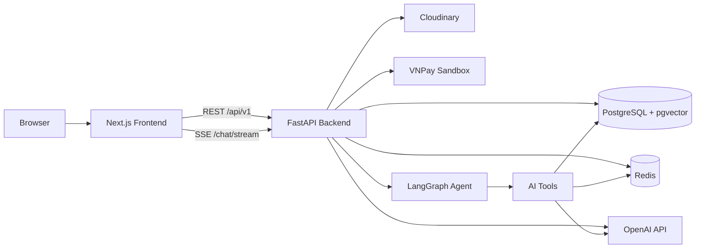
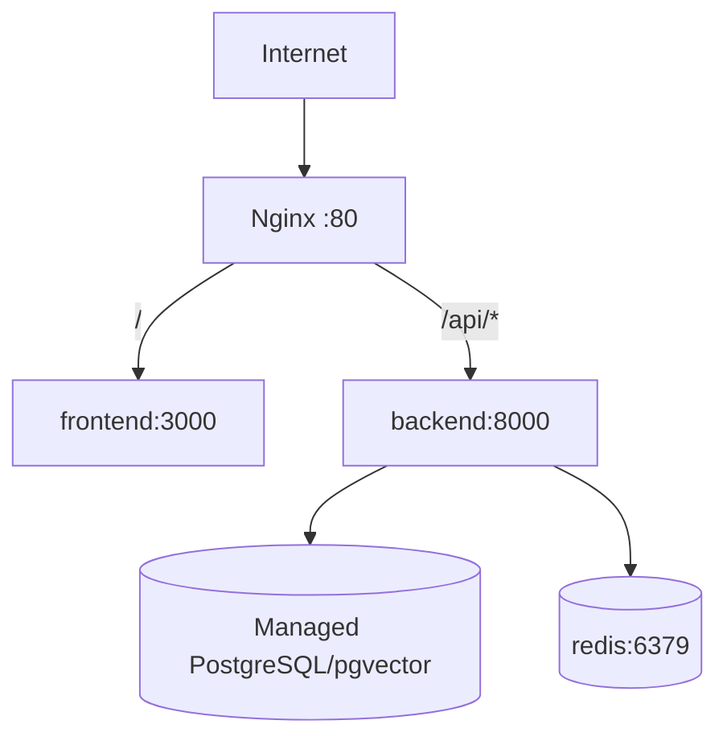
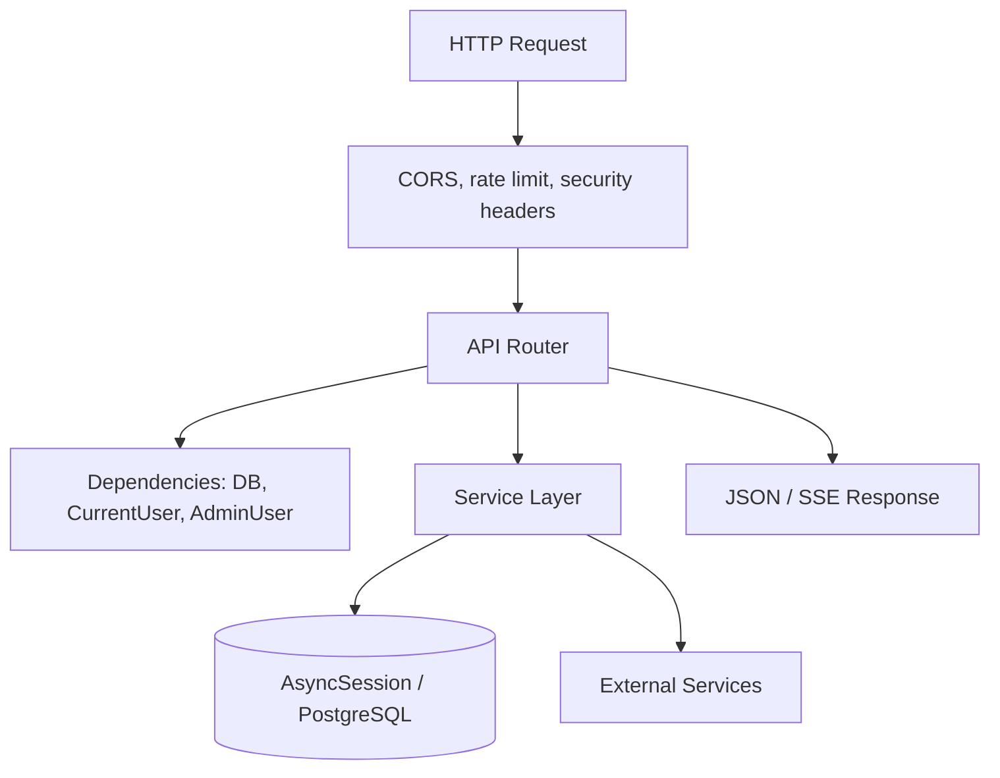
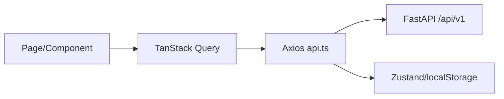
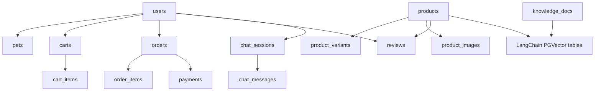
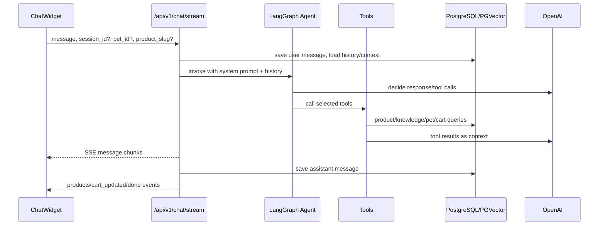
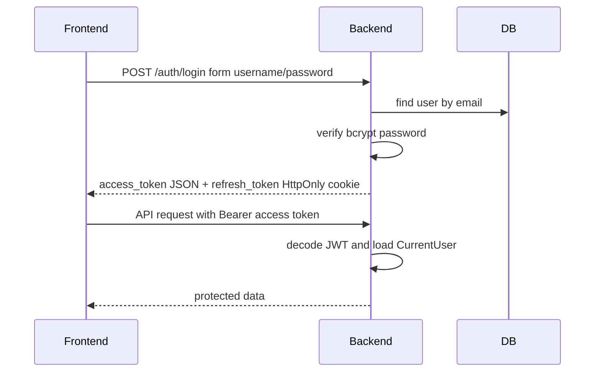
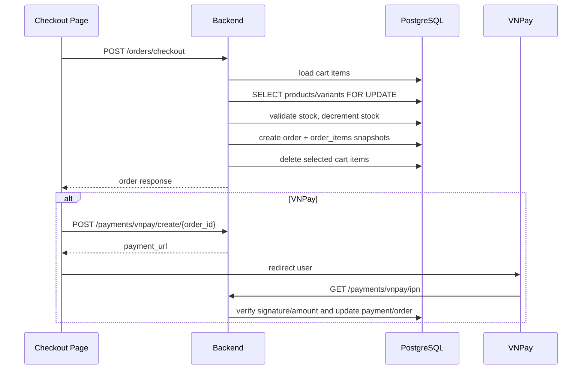

# Architecture - ThePawsome

Tài liệu này mô tả kiến trúc tổng thể của ThePawsome: cách frontend, backend, database, AI/RAG và các dịch vụ ngoài phối hợp với nhau.

## 1. Tổng quan

ThePawsome là hệ thống pet-shop e-commerce tích hợp trợ lý AI. Kiến trúc được tổ chức theo mô hình web app tách frontend/backend:

- Frontend Next.js cung cấp storefront, auth pages, checkout, admin dashboard và chat widget.
- Backend FastAPI là API gateway/business service cho commerce, auth, admin và AI orchestration.
- PostgreSQL/pgvector lưu dữ liệu nghiệp vụ và vector embeddings.
- Redis phục vụ rate limit và cache ngắn hạn.
- OpenAI/LangGraph xử lý hội thoại AI, tool-calling và embeddings.
- Cloudinary lưu ảnh upload.
- VNPay sandbox xử lý thanh toán online.
- Nginx reverse proxy định tuyến production.



## 2. Mục tiêu kiến trúc

- Tách rõ UI, API, dữ liệu và AI orchestration.
- Giữ backend stateless để dễ deploy bằng Docker.
- Đảm bảo commerce data đúng bằng transaction, row lock, DB constraints và snapshot order items.
- Cho phép AI dùng dữ liệu thật thay vì trả lời chung chung.
- Tối ưu cho đồ án: dễ chạy local, dễ demo, dễ giải thích trong báo cáo.
- Có đường mở rộng production: CI/CD, healthcheck, Nginx, Docker images.

## 3. Repository layout

```text
.
├── backend/
│   ├── app/
│   │   ├── api/routers/       # FastAPI routers public/admin
│   │   ├── core/              # config, security, redis, limiter, email
│   │   ├── models/            # SQLAlchemy domain models
│   │   ├── services/          # AI, retrieval, indexing, VNPay, cache services
│   │   ├── database.py        # async engine/session
│   │   └── main.py            # app entrypoint
│   ├── alembic/               # database migrations
│   ├── scripts/               # importer/seed/eval scripts
│   └── tests/                 # pytest integration tests
├── frontend/
│   ├── src/app/               # Next.js App Router route groups
│   ├── src/components/        # layout, chat, reviews, UI primitives
│   ├── src/lib/               # API client, store, shared types
│   └── src/providers/         # React Query provider
├── docs/                      # requirements, ERD, API spec, wireframes
├── docker-compose.yml
├── docker-compose.prod.yml
└── nginx/nginx.conf
```

## 4. Runtime architecture

### Local development

Local stack chạy theo từng service:

```text
localhost:3000  Next.js dev server
localhost:8000  FastAPI dev server
localhost:5432  PostgreSQL/pgvector container
localhost:6379  Redis container
```

Frontend gọi backend qua `NEXT_PUBLIC_API_URL=http://localhost:8000/api/v1`.

### Production deployment

Production compose chạy Redis, backend, frontend và Nginx. PostgreSQL production được cung cấp qua `DATABASE_URL`.



Backend image tự chạy `alembic upgrade head` trước khi start Uvicorn. Frontend image dùng Next standalone output.

## 5. Backend architecture

Backend dùng FastAPI với SQLAlchemy async.



### Entry point

`backend/app/main.py` chịu trách nhiệm:

- Khởi tạo `FastAPI`.
- Kiểm tra `SECRET_KEY` ở startup.
- Bật CORS theo `ALLOWED_ORIGINS`.
- Gắn SlowAPI rate limiter dùng Redis.
- Thêm security headers cơ bản.
- Mount routers dưới `/api/v1`.
- Dispose DB engine và đóng Redis khi shutdown.

### API layer

Routers chính:

- `auth`: register, login, refresh, logout, password reset, Google OAuth, profile.
- `products`: listing, facets, detail, best sellers, new arrivals, recommendations, similar products.
- `categories`, `banners`: dữ liệu public cho storefront.
- `cart`, `orders`, `payments`: commerce flow.
- `pets`: hồ sơ thú cưng.
- `reviews`: review/rating sản phẩm.
- `chat`: chat sessions/messages và SSE streaming.
- `admin/*`: stats, products, orders, users, banners, knowledge, embeddings.

### Dependency layer

`backend/app/api/deps.py` định nghĩa:

- `SessionDep`: async database session per request.
- `CurrentUser`: yêu cầu Bearer access token.
- `OptionalUser`: cho endpoint public có thể cá nhân hóa nếu có token.
- `AdminUser`: guard role admin.

### Service layer

`backend/app/services/` chứa logic ngoài router:

- `chat_agent.py`: build LangGraph agent và AI tools.
- `retrieval.py`: hybrid product search, knowledge search, similar products.
- `embeddings.py`: OpenAI embeddings, PGVector store, Redis cache query embedding.
- `indexing.py`: reindex products/knowledge vào PGVector collections.
- `vnpay.py`: ký URL và xác minh callback/IPN.
- `pets_service.py`: cache pet profile context.

## 6. Frontend architecture

Frontend dùng Next.js App Router, chia theo route groups.

```text
src/app/
├── (shop)/        # storefront, cart, checkout, orders, profile
├── (auth)/        # login/register/forgot/reset password
├── admin/         # admin dashboard
├── auth/google/   # OAuth callback
└── orders/payment # VNPay callback page
```

### Data fetching

- `src/lib/api.ts` là axios instance dùng chung.
- Request interceptor gắn `Authorization: Bearer <token>` từ `localStorage`.
- Response interceptor xử lý `401` bằng `/auth/refresh`, queue các request đang chờ và replay sau khi có access token mới.
- TanStack Query quản lý server state, cache và refetch.
- Zustand quản lý auth state và product context cho chat widget.



### UI composition

- `Header`, `Footer`, `ConditionalChatWidget` được mount trong shop layout.
- Admin có layout riêng để ưu tiên dashboard/table/form.
- UI primitives nằm trong `src/components/ui/`.
- Design tokens nằm trong `globals.css` và `tailwind.config.ts`.

## 7. Data architecture

PostgreSQL là database chính. Schema được quản lý bằng Alembic, không dùng `create_all` trong production.

Nhóm bảng domain:

- Identity: `users`, `pets`
- Catalog: `categories`, `banners`, `products`, `product_variants`, `product_images`
- Commerce: `carts`, `cart_items`, `orders`, `order_items`, `payments`
- Reviews: `reviews`
- AI chat: `chat_sessions`, `chat_messages`
- Knowledge: `knowledge_docs`
- Vector store: `langchain_pg_collection`, `langchain_pg_embedding`



Các nguyên tắc dữ liệu quan trọng:

- Order item lưu snapshot tên, giá, SKU và attributes.
- Guest order dùng `orders.user_id = null` và `guest_email`.
- Product có thể có hoặc không có variant.
- Product images tách bảng để hỗ trợ gallery, variant image và attr image.
- DB constraints bảo vệ price, sale price, stock, quantity, order total, payment amount, SKU và external transaction id.

## 8. AI/RAG architecture

AI assistant là phần tích hợp giữa LLM, tool-calling, product catalog và knowledge base.



### Context layers

1. Pet profile context: loài, giống, tuổi, cân nặng, sức khỏe, dị ứng.
2. Product context: sản phẩm user đang xem hoặc kết quả `search_products`.
3. Knowledge context: tài liệu chăm sóc thú cưng từ `knowledge_docs`.

### Tools

- `search_products_tool`: tìm sản phẩm bằng hybrid search.
- `search_knowledge_tool`: tìm knowledge chunks trong PGVector.
- `add_to_cart_tool`: thêm sản phẩm không có variant vào giỏ, hoặc yêu cầu user chọn variant.
- `view_cart_tool`: xem giỏ hàng hiện tại.
- `list_pets_tool`: liệt kê pet của user.
- `get_pet_detail_tool`: lấy chi tiết một pet theo tên hoặc UUID.

### Retrieval

Product retrieval dùng hybrid ranking:

- Semantic rank từ PGVector collection `petshop_products`.
- Keyword rank từ bảng `products`.
- Weighted Reciprocal Rank Fusion để hợp nhất kết quả.

Knowledge retrieval dùng PGVector collection `petshop_knowledge`.

Query embedding được cache trong Redis bằng key hash SHA-256 với TTL 1 giờ.

### Indexing

Admin có thể reindex:

- `POST /api/v1/admin/embeddings/products/reindex`
- `POST /api/v1/admin/embeddings/knowledge/reindex`

Indexing service tạo `Document` với metadata ổn định như `slug`, `product_id`, `title`, `category`, `source_url`.

## 9. Authentication and authorization

Auth dùng JWT access token và refresh token cookie.



Authorization:

- User endpoints yêu cầu `CurrentUser`.
- Public endpoints dùng no auth hoặc `OptionalUser`.
- Admin endpoints yêu cầu `AdminUser`.
- Frontend cũng gate admin UI, nhưng backend guard là lớp bắt buộc.

## 10. Commerce architecture

### User checkout



### Guest checkout

Guest checkout nhận item list từ frontend guest cart, không cần `CurrentUser`. Backend vẫn lock stock, tạo order và lưu `guest_email` để tra cứu.

### Payment policy

- COD: order tạo với `payment_status=unpaid`.
- VNPay: backend tạo signed payment URL; IPN xác minh chữ ký, amount và transaction id.
- `external_txn_id` unique để giảm duplicate gateway callback.

## 11. Admin architecture

Admin UI là một app surface riêng trong `frontend/src/app/admin`.

Admin backend surface:

- `GET /admin/stats`
- `/admin/products*`
- `/admin/orders*`
- `/admin/users*`
- `/admin/banners*`
- `/admin/knowledge*`
- `/admin/embeddings*`

Admin workflows ảnh hưởng trực tiếp đến storefront và AI:

- Product CRUD cập nhật catalog.
- Product image/variant workflow cập nhật product detail và cart/checkout.
- Knowledge CRUD + reindex cập nhật RAG answer context.
- Embedding reindex đồng bộ dữ liệu mới vào vector search.

## 12. External integrations

| Service | Vai trò | Config |
|---|---|---|
| PostgreSQL/pgvector | Domain DB và vector store | `DATABASE_URL` hoặc `POSTGRES_*` |
| Redis | Rate limit, embedding cache, pet context cache | `REDIS_URL` |
| OpenAI | Chat model và embedding model | `OPENAI_API_KEY`, `CHAT_MODEL`, `EMBEDDING_MODEL` |
| Cloudinary | Upload ảnh | `CLOUDINARY_*` |
| VNPay | Payment sandbox | `VNPAY_*` |
| Google OAuth | Social login | `GOOGLE_CLIENT_ID`, `GOOGLE_CLIENT_SECRET` |
| SMTP | Reset password email | `MAIL_*` |
| LangSmith | Optional tracing | `LANGSMITH_*` |

## 13. Security architecture

Các lớp bảo vệ hiện có:

- bcrypt password hashing.
- JWT token type: access, refresh, reset.
- Refresh token trong HttpOnly cookie.
- Secret yếu bị chặn ở startup.
- Production yêu cầu secret dài và secure cookie.
- CORS whitelist.
- Security headers: content type options, frame options, referrer policy, permissions policy, HSTS production.
- SlowAPI rate limit dùng Redis.
- Pydantic validation cho request bodies.
- DB constraints cho nghiệp vụ commerce.

Các điểm còn trong roadmap:

- Refresh token rotation/blacklist.
- Request id và structured logging.
- Health readiness check DB/Redis.
- Guest order detail hardening bằng lookup token hoặc email/code guard chặt hơn.

## 14. Testing and CI architecture

Backend:

- `ruff check .`
- `pytest`
- Tests chạy với Postgres/Redis thật.
- CI chạy Alembic migration trước tests.

Frontend:

- `npm run lint`
- `npm run build`

CI/CD:

```text
push/pull_request
  -> backend test job
  -> frontend lint/build job
  -> build backend image
  -> build frontend image
  -> deploy by SSH on main push
```

## 15. Extension points

Các phần dễ mở rộng:

- Thêm payment provider mới bằng service tương tự `vnpay.py`.
- Thêm AI tool mới trong `chat_agent.py`.
- Thêm retrieval source mới bằng collection PGVector riêng.
- Thêm admin module mới dưới `backend/app/api/routers/admin/` và `frontend/src/app/admin/`.
- Thêm product filter mới qua `products.py`, frontend query params và indexes nếu cần.
- Thêm observability bằng middleware request id/logging trước routers.

## 16. Known trade-offs

- Một số script lịch sử trong `backend/scripts/` còn dùng sync session và cần cập nhật nếu dùng làm demo chính thức.
- Vector store do LangChain PGVector quản lý, không có model domain riêng trong `app/models`.
- `products.images` vẫn tồn tại như fallback/legacy trong khi ảnh chi tiết nằm ở `product_images`.
- Checkout trừ stock ngay cả với VNPay pending; cần policy restock/expiration khi payment fail hoặc timeout.
- Healthcheck backend hiện chỉ là liveness cơ bản, chưa kiểm tra DB/Redis readiness.

## 17. Related documents

- [README.md](./README.md): quickstart và vận hành.
- [DATN.md](./DATN.md): phạm vi đồ án và tiêu chí bảo vệ.
- [DESIGN.md](./DESIGN.md): design system frontend.
- [docs/requirements.md](./docs/requirements.md): requirements và traceability.
- [docs/erd.md](./docs/erd.md): ERD.
- [docs/data-dictionary.md](./docs/data-dictionary.md): data dictionary.
- [docs/db-design-decisions.md](./docs/db-design-decisions.md): rationale dữ liệu.
- [docs/api-spec.yaml](./docs/api-spec.yaml): API contract.
- [docs/production-readiness-plan.md](./docs/production-readiness-plan.md): roadmap hardening.
