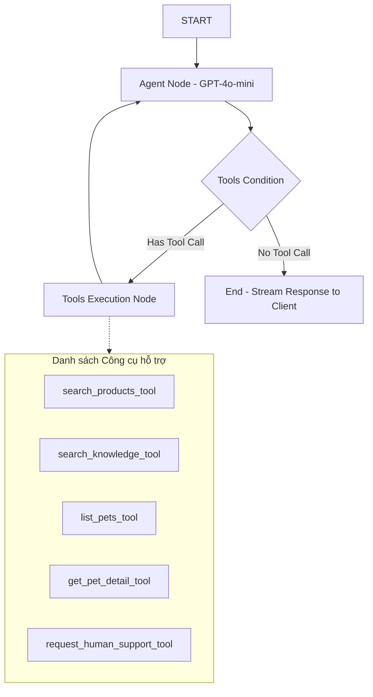

# Kiến trúc Hệ thống (System Architecture) - ThePawsome

Tài liệu này đặc tả kiến trúc kỹ thuật toàn diện của hệ thống ThePawsome, bao gồm cấu trúc phân lớp ứng dụng, luồng tương tác dữ liệu, thiết kế RAG AI và các điểm tích hợp dịch vụ.

---

## 1. Tổng quan Kiến trúc phân lớp (Multi-Tier Architecture)

ThePawsome tuân thủ mô hình kiến trúc phân lớp chuẩn cho các ứng dụng web hiện đại, đảm bảo tính tách biệt trách nhiệm (Separation of Concerns).

```
+--------------------------------------------------------------+
|                    Next.js Client (SPA)                      |  Presentation Layer (Next.js 16, TS, Tailwind)
+--------------------------------------------------------------+
                               | HTTPS / SSE (Event Stream)
                               v
+--------------------------------------------------------------+
|                    Nginx Reverse Proxy                       |  Gateway / Reverse Proxy Layer
+--------------------------------------------------------------+
                               | Reverse Proxy
                               v
+--------------------------------------------------------------+
|                    FastAPI Backend (Uvicorn)                 |  Application Layer (FastAPI, Asyncio)
+--------------------------------------------------------------+
         |                     |                     |
         v (SQL)               v (Key-Value)         v (RAG SDK)
+-----------------+   +-----------------+   +------------------+
| PostgreSQL ACID |   |   Redis Cache   |   | PGVector Store   |  Data & Vector Layer
|  Primary / RR   |   |  Blacklist/RRF  |   |  Products/Docs   |
+-----------------+   +-----------------+   +------------------+
```

---

## 2. Đặc tả Tầng ứng dụng Backend (FastAPI)

Backend được phát triển bằng **FastAPI**, tận dụng tối đa cơ chế xử lý không đồng bộ (Async/Await) của Python để đạt băng thông xử lý lớn và độ trễ cực thấp.

### Cấu trúc phân mục nguồn (`backend/app/`):
- [**main.py**](file:///home/quang/Documents/DATN/backend/app/main.py): Khởi tạo FastAPI app, cấu hình CORS, SlowAPI rate limiters, các middleware quản lý ngữ cảnh Request ID, tiêm header bảo mật và cấu hình vòng đời ứng dụng (Lifespan).
- [**api/deps.py**](file:///home/quang/Documents/DATN/backend/app/api/deps.py): Khai báo các Dependency Injection dùng chung cho API (kết nối database session AsyncSession, kiểm tra và xác thực JWT token của user/admin/expert).
- [**models/**](file:///home/quang/Documents/DATN/backend/app/models/): Chứa khai báo các bảng dữ liệu SQLAlchemy (xem chi tiết tại [Từ điển dữ liệu](file:///home/quang/Documents/DATN/docs/data-dictionary.md)).
- [**services/**](file:///home/quang/Documents/DATN/backend/app/services/): Tầng chứa mã nguồn logic nghiệp vụ nghiệp vụ phức tạp:
  - [**chat_agent.py**](file:///home/quang/Documents/DATN/backend/app/services/chat_agent.py): Thiết kế Agent LangGraph (xem chi tiết ở phần 4).
  - [**retrieval.py**](file:///home/quang/Documents/DATN/backend/app/services/retrieval.py): Logic tìm kiếm kết hợp Hybrid RRF và Cohere Rerank.
  - [**indexing.py**](file:///home/quang/Documents/DATN/backend/app/services/indexing.py): Helper quản lý xóa/cập nhật và đồng bộ vector vào pgvector một cách phi tuần tự và an toàn (async-safe).
  - [**inventory.py**](file:///home/quang/Documents/DATN/backend/app/services/inventory.py): Quản lý giữ kho và khóa dòng bi quan tránh bán vượt tồn kho.
  - [**vnpay.py**](file:///home/quang/Documents/DATN/backend/app/services/vnpay.py) & [**sepay.py**](file:///home/quang/Documents/DATN/backend/app/services/sepay.py): Xử lý tích hợp thanh toán.

---

## 3. Đặc tả Tầng giao diện Frontend (Next.js)

Frontend được phát triển bằng **Next.js 16 App Router** kết hợp với **TypeScript** và **Tailwind CSS**.

### Các thành phần kỹ thuật cốt lõi:
- **Quản lý trạng thái (State Management):** Sử dụng **Zustand** làm bộ lưu trữ trạng thái người dùng đăng nhập, token xác thực (`useAuthStore`) và trạng thái sản phẩm người dùng đang xem để gửi làm ngữ cảnh cho Catbot (`useViewingProductStore`).
- **Giao tiếp API:** Sử dụng **Axios** có cấu hình Interceptor tự động bắt lỗi `401 Unauthorized` để gọi `/auth/refresh` lấy Access Token mới qua cookie một cách trong suốt mà không làm gián đoạn trải nghiệm của người dùng.
- **Tương tác thời gian thực:** Kết nối với API chat bằng Server-Sent Events (SSE) để render nội dung câu trả lời của Catbot theo dạng gõ chữ mượt mà.

---

## 4. Kiến trúc RAG & LangGraph Agent

Catbot được xây dựng trên nền tảng **LangGraph** thay vì chuỗi tuyến tính truyền thống, cho phép thiết kế vòng lặp phản hồi linh hoạt dựa trên tác vụ và kết quả gọi công cụ (Tool Call).



- **Vòng lặp Agent-Tools:** Cho phép Catbot tự lập kế hoạch hành động. Ví dụ: khi được hỏi về thực đơn cho chó cưng, Catbot sẽ tự động gọi `list_pets_tool` $\rightarrow$ phát hiện bé cưng là Poodle 5 tháng tuổi $\rightarrow$ gọi `get_pet_detail_tool` lấy thông tin dị ứng gà $\rightarrow$ gọi tiếp `search_knowledge_tool` để tìm thực đơn phù hợp không chứa gà $\rightarrow$ gọi `search_products_tool` tìm hạt thịt bò bán trong shop $\rightarrow$ tổng hợp câu trả lời cuối cùng gửi cho khách hàng.
- **Định tuyến hỗ trợ (HITL Handoff):** Khi người dùng muốn nói chuyện với nhân viên hỗ trợ hoặc khi Catbot phát hiện khiếu nại đổi trả gay gắt qua lý do tham số của tool `request_human_support_tool`, hệ thống sẽ cập nhật trạng thái định tuyến hội thoại sang `pending_human` để nhân viên hỗ trợ ở Dashboard Admin tiếp quản cuộc trò chuyện qua cổng chat trực tiếp (Human Handoff).
