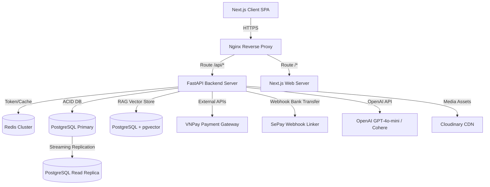

# Yêu cầu Doanh nghiệp & Hạ tầng (Enterprise Requirements) - ThePawsome

Tài liệu này đặc tả các tiêu chuẩn kỹ thuật cấp doanh nghiệp, giải pháp hạ tầng mở rộng, khả năng chịu tải và bảo mật hệ thống ThePawsome.

---

## 1. Thiết kế Hệ thống & Sơ đồ Hạ tầng vật lý

Hệ thống được thiết kế theo mô hình Monorepo chứa Microservices thu nhỏ, sẵn sàng đóng gói Docker và triển khai lên các dịch vụ đám mây (AWS, GCP) hoặc máy chủ vật lý riêng biệt thông qua Docker Compose.



- **Nginx Reverse Proxy:** Đảm nhận vai trò SSL Termination, nén gzip dữ liệu, thiết lập Rate Limiter cấp hạ tầng và bảo vệ backend khỏi các truy vấn trực tiếp.
- **FastAPI Backend (Uvicorn):** Chạy đa tiến trình (Workers) bằng uvicorn. Hoàn toàn không đồng bộ (Asyncio) giúp tăng cường băng thông xử lý lên đến hàng ngàn request đồng thời trên mỗi node.
- **PostgreSQL & PGVector:**
  - Database chính hỗ trợ ghi và đọc các giao dịch tài chính ACID.
  - Sử dụng cơ chế Streaming Replication để đồng bộ dữ liệu sang Read Replica giúp giảm tải các truy vấn đọc báo cáo, thống kê và tìm kiếm sản phẩm.

---

## 2. Chiến lược mở rộng quy mô dữ liệu (Scalability)

### A. Tối ưu hóa pgvector cho dữ liệu quy mô lớn (RAG Scale)
Khi số lượng sản phẩm và bài viết diễn đàn tăng lên hàng triệu bản ghi, việc quét vector đầy đủ (Flat search) sẽ gây nghẽn RAM và tăng độ trễ. 
- **Giải pháp:** Áp dụng chỉ mục **HNSW (Hierarchical Navigable Small World)** hoặc **IVFFlat** cho các cột vector của PGVector:
  ```sql
  CREATE INDEX ON langchain_pg_embedding USING hnsw (embedding vector_cosine_ops) WITH (m = 16, ef_construction = 64);
  ```
- **Phân tách bộ nhớ đệm (Vector Caching):** Sử dụng Redis làm tầng đệm lưu trữ kết quả embedding câu hỏi (`emb:query`) với TTL 1 giờ giúp loại bỏ hoàn toàn các yêu cầu trùng lặp gửi đến OpenAI, bảo vệ hệ thống khỏi nghẽn mạng API bên thứ ba.

### B. Phân mảnh Dữ liệu & Lưu trữ (Storage Partitioning)
- Các bảng lịch sử có dung lượng lớn như `audit_logs` và `ai_call_logs` được cấu hình phân vùng bảng (Table Partitioning) theo tháng hoặc năm để duy trì tốc độ đọc ghi của Database chính.
- Toàn bộ hình ảnh, tài liệu phương tiện được lưu trữ trực tiếp trên **Cloudinary CDN**, giảm tải tối đa băng thông truyền tải file tĩnh của máy chủ ứng dụng.

---

## 3. Độ tin cậy & Phục hồi sau thảm họa (Disaster Recovery)

Hệ thống ThePawsome đặt mục tiêu đạt chuẩn **RTO (Recovery Time Objective) < 30 phút** và **RPO (Recovery Point Objective) < 5 phút**:
1. **Sao lưu Database tự động (Backups):**
   - Thực hiện sao lưu định kỳ hàng ngày (Daily logical backups) bằng `pg_dump` và đẩy lưu trữ lên AWS S3 (hoặc Google Cloud Storage) với chính sách lưu giữ tối đa 30 ngày.
   - Bật tính năng sao lưu ghi nhật ký (Write-Ahead Logging - WAL) để hỗ trợ phục hồi dữ liệu tại bất kỳ thời điểm nào trong ngày (Point-in-Time Recovery - PITR).
2. **Khả năng tự hồi phục (Self-Healing):**
   - Docker Compose được cấu hình `restart: always` cho các dịch vụ cốt lõi.
   - FastAPI tích hợp Health Check Ready/Live endpoint (`/health/ready` và `/health/live`) cho phép các bộ cân bằng tải (Load Balancer) tự động ngắt kết nối các node backend lỗi và khởi động lại chúng.
3. **Quản lý Hạn mức và Lỗi API bên thứ ba:**
   - Các API ngoài (OpenAI, VNPay, SePay) được bọc trong các khối `try/except` có tích hợp cơ chế tự động thử lại (Retry) và ngắt mạch tự động (Circuit Breaker) để tránh tình trạng treo backend khi dịch vụ bên thứ ba bị sập.

---

## 4. Chính sách lưu trữ dữ liệu (Data Retention Policy)

- **Thông tin tài khoản và Giao dịch:** Lưu trữ vĩnh viễn dữ liệu người dùng (`users`), thú cưng (`pets`), đơn hàng (`orders`), và lịch sử thanh toán (`payments`) phục vụ kiểm toán tài chính và báo cáo thuế doanh nghiệp.
- **Dữ liệu log giám sát (`audit_logs`, `ai_call_logs`):** Tự động dọn dẹp hoặc lưu trữ nén (Archived) sang kho lưu trữ lạnh sau 90 ngày.
- **Giỏ hàng tạm thời:** Giỏ hàng vãng lai không có hoạt động cập nhật sẽ bị hệ thống tự động xóa khỏi Database sau 30 ngày để tối ưu dung lượng lưu trữ.
