# Sơ đồ quan hệ thực thể (ERD) - ThePawsome

Tài liệu này chứa sơ đồ thực thể mối quan hệ (Entity Relationship Diagram) của toàn bộ hệ thống cơ sở dữ liệu ThePawsome, được xây dựng dựa trên các model thực tế trong mã nguồn backend (`backend/app/models/`).

## Sơ đồ Mermaid ERD

```mermaid
erDiagram
    User ||--o{ Pet : "owner"
    User ||--o| Cart : "has"
    User ||--o{ Order : "places"
    User ||--o{ ChatSession : "owns"
    User ||--o{ Review : "writes"
    User ||--o{ RefreshSession : "has"
    User ||--o{ ForumThread : "authors"
    User ||--o{ ForumReply : "replies"
    User ||--o{ WishlistItem : "adds"
    User ||--o{ AuditLog : "triggers"
    User ||--o{ AICallLog : "runs"
    User ||--o{ OrderReturn : "requests"

    Pet ||--o{ ChatSession : "context_for"

    Category ||--o{ Category : "parent"
    Category ||--o{ Product : "contains"

    Product ||--o{ ProductVariant : "has"
    Product ||--o{ ProductImage : "has"
    Product ||--o{ Review : "receives"
    Product ||--o{ CartItem : "in"
    Product ||--o{ OrderItem : "in"
    Product ||--o{ WishlistItem : "in"

    ProductVariant ||--o{ ProductImage : "has"
    ProductVariant ||--o{ CartItem : "in"
    ProductVariant ||--o{ OrderItem : "in"

    Cart ||--o{ CartItem : "contains"

    Order ||--o{ OrderItem : "contains"
    Order ||--o{ Payment : "has"
    Order ||--o{ InventoryReservation : "holds"
    Order ||--o{ OrderReturn : "returns"
    Promotion ||--o{ Order : "product_coupon"
    Promotion ||--o{ Order : "shipping_coupon"

    OrderItem ||--|| InventoryReservation : "reserves"

    OrderReturn ||--o{ OrderReturnItem : "contains"
    OrderItem ||--|| OrderReturnItem : "returned"

    ChatSession ||--o{ ChatMessage : "contains"
    ChatSession ||--o{ AICallLog : "logs"

    ForumThread ||--o{ ForumReply : "contains"
    ForumThread ||--o{ ForumThreadVote : "votes"
    ForumReply ||--o{ ForumReply : "parent"
    ForumReply ||--o{ ForumReplyVote : "votes"

    User {
        uuid id PK
        string email UK
        string hashed_password
        string full_name
        string phone
        text address
        RoleEnum role
        jsonb scopes
        boolean is_expert_verified
        boolean is_active
        boolean email_verified
        datetime created_at
        datetime updated_at
    }

    RefreshSession {
        uuid id PK
        uuid user_id FK
        string jti UK
        datetime expires_at
        datetime revoked_at
        string replaced_by_jti
        datetime created_at
    }

    Pet {
        uuid id PK
        uuid user_id FK
        string name
        SpeciesEnum species
        string breed
        integer age_months
        numeric weight_kg
        GenderEnum gender
        text health_notes
        text allergies
        string avatar_url
        datetime created_at
        datetime updated_at
    }

    Category {
        integer id PK
        string name
        string slug UK
        integer parent_id FK
        string image_url
        datetime created_at
    }

    Banner {
        integer id PK
        string image_url
        string desktop_image_url
        string mobile_image_url
        string title
        string subtitle
        string link_url
        integer sort_order
        boolean is_active
        datetime created_at
        datetime updated_at
    }

    Product {
        uuid id PK
        integer category_id FK
        string name
        string slug UK
        text description
        numeric price
        numeric sale_price
        integer stock_qty
        string brand
        jsonb images
        jsonb target_species
        jsonb attributes
        boolean is_active
        integer sold_count
        numeric avg_rating
        integer review_count
        datetime created_at
        datetime updated_at
    }

    ProductVariant {
        uuid id PK
        uuid product_id FK
        string sku UK
        numeric price
        numeric sale_price
        integer stock_qty
        jsonb attributes
        boolean is_active
        datetime created_at
    }

    ProductImage {
        uuid id PK
        uuid product_id FK
        uuid variant_id FK
        string attr_key
        string attr_value
        string url
        string alt_text
        boolean is_main
        integer sort_order
    }

    Cart {
        uuid id PK
        uuid user_id FK "UK"
        datetime created_at
        datetime updated_at
    }

    CartItem {
        uuid id PK
        uuid cart_id FK
        uuid product_id FK
        uuid variant_id FK
        integer quantity
        datetime added_at
    }

    Promotion {
        uuid id PK
        string code UK
        text description
        PromotionTypeEnum promo_type
        DiscountTypeEnum discount_type
        numeric discount_value
        numeric min_subtotal
        numeric max_discount
        datetime starts_at
        datetime expires_at
        integer usage_limit
        integer usage_count
        boolean is_active
        datetime created_at
    }

    Order {
        uuid id PK
        uuid user_id FK
        string order_code UK
        OrderStatusEnum status
        numeric subtotal
        numeric shipping_fee
        numeric total
        string ship_name
        string ship_phone
        text ship_address
        PaymentMethodEnum payment_method
        PaymentStatusEnum payment_status
        text note
        string guest_email
        uuid applied_product_coupon_id FK
        uuid applied_shipping_coupon_id FK
        numeric discount_amount
        numeric shipping_discount_amount
        string idempotency_scope
        string idempotency_key
        string request_hash
        datetime created_at
        datetime updated_at
    }

    OrderItem {
        uuid id PK
        uuid order_id FK
        uuid product_id FK
        uuid variant_id FK
        string product_name_snapshot
        string variant_sku_snapshot
        jsonb variant_attributes_snapshot
        numeric unit_price_snapshot
        integer quantity
    }

    Payment {
        uuid id PK
        uuid order_id FK
        PaymentMethodEnum method
        numeric amount
        TxnStatusEnum status
        string external_txn_id UK
        string merchant_ref UK
        string idempotency_key
        text payment_url
        datetime expires_at
        boolean requires_review
        jsonb raw_response
        datetime created_at
    }

    InventoryReservation {
        uuid id PK
        uuid order_id FK
        uuid order_item_id FK "UK"
        uuid product_id FK
        uuid variant_id FK
        integer quantity
        ReservationStatusEnum status
        datetime expires_at
        datetime released_at
        datetime committed_at
        datetime created_at
    }

    OrderReturn {
        uuid id PK
        uuid order_id FK
        uuid user_id FK
        ReturnStatusEnum status
        text reason
        numeric refund_amount
        text admin_notes
        datetime created_at
        datetime updated_at
    }

    OrderReturnItem {
        uuid id PK
        uuid return_id FK
        uuid order_item_id FK "UK"
        integer quantity
    }

    ChatSession {
        uuid id PK
        uuid user_id FK
        uuid pet_id FK
        string title
        ChatRoutingStatusEnum routing_status
        datetime created_at
        datetime updated_at
    }

    ChatMessage {
        uuid id PK
        uuid session_id FK
        ChatRoleEnum role
        text content
        jsonb tool_calls
        jsonb token_usage
        boolean is_from_human
        datetime created_at
    }

    KnowledgeDoc {
        uuid id PK
        string title
        string source_url
        DocCategoryEnum category
        text content
        uuid owner_id FK
        string review_status
        datetime last_reviewed_at
        integer version
        datetime created_at
        datetime updated_at
    }

    Review {
        uuid id PK
        uuid user_id FK
        uuid product_id FK
        integer rating
        text comment
        datetime created_at
    }

    ForumThread {
        uuid id PK
        uuid author_id FK
        string title
        string slug UK
        ForumCategoryEnum category
        text body
        jsonb tags
        ForumStatusEnum status
        boolean is_locked
        boolean is_ai_blocked
        KnowledgeStatusEnum knowledge_status
        integer knowledge_score
        datetime knowledge_indexed_at
        integer upvote_count
        integer downvote_count
        integer reply_count
        uuid accepted_reply_id
        datetime last_activity_at
        datetime created_at
        datetime updated_at
    }

    ForumReply {
        uuid id PK
        uuid thread_id FK
        uuid parent_reply_id FK
        uuid author_id FK
        text body
        ForumStatusEnum status
        boolean is_ai_blocked
        boolean is_expert_answer
        boolean is_accepted
        integer upvote_count
        integer downvote_count
        integer expert_upvote_count
        KnowledgeStatusEnum knowledge_status
        integer knowledge_score
        datetime knowledge_indexed_at
        datetime created_at
        datetime updated_at
    }

    ForumThreadVote {
        uuid id PK
        uuid thread_id FK
        uuid user_id FK
        integer value
        datetime created_at
        datetime updated_at
    }

    ForumReplyVote {
        uuid id PK
        uuid reply_id FK
        uuid user_id FK
        integer value
        datetime created_at
        datetime updated_at
    }

    AuditLog {
        uuid id PK
        uuid user_id FK
        string action
        string resource_type
        string resource_id
        jsonb old_values
        jsonb new_values
        string ip_address
        string user_agent
        datetime created_at
    }

    AICallLog {
        uuid id PK
        uuid user_id FK
        uuid session_id FK
        string model_name
        integer prompt_tokens
        integer completion_tokens
        numeric cost_usd
        integer latency_ms
        datetime created_at
    }

    WishlistItem {
        uuid id PK
        uuid user_id FK
        uuid product_id FK
        datetime created_at
    }
```

## Các ràng buộc và quan hệ đặc biệt
- **Idempotency (Không trùng lặp giao dịch/đơn hàng):** Bảng `Order` định nghĩa ràng buộc duy nhất `uq_orders_idempotency_scope_key` trên `(idempotency_scope, idempotency_key)`. Bảng `Payment` có ràng buộc duy nhất trên `(order_id, idempotency_key)`.
- **Inventory Reservation:** Ràng buộc chặt chẽ `order_item_id` là duy nhất (`unique=True`) trong bảng `InventoryReservation`, đảm bảo mỗi dòng mặt hàng trong đơn hàng chỉ được tạo tối đa một yêu cầu giữ kho.
- **Forum & RAG Knowledge Sync:** Trạng thái `knowledge_status` (eligible, not_eligible, blocked) của forum thread và replies trực tiếp xác định dữ liệu đó có được đưa vào PGVector phục vụ RAG hay không.
