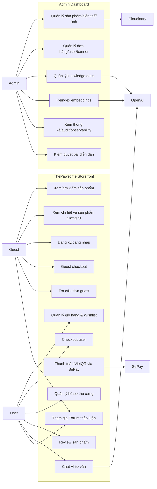
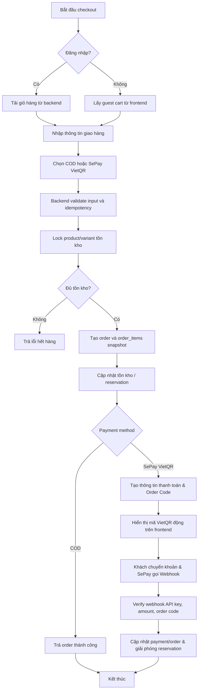
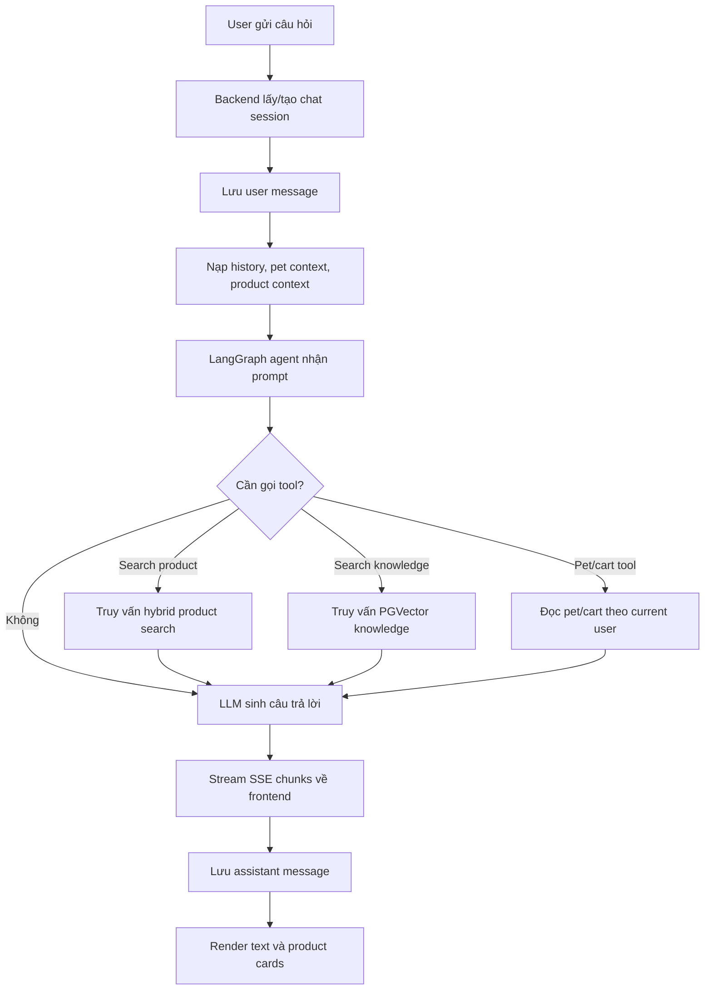
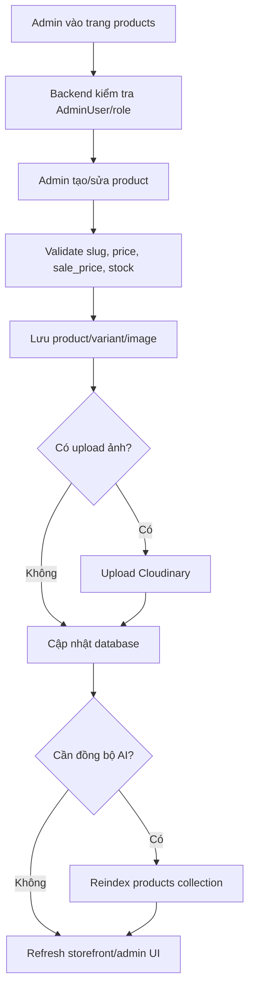
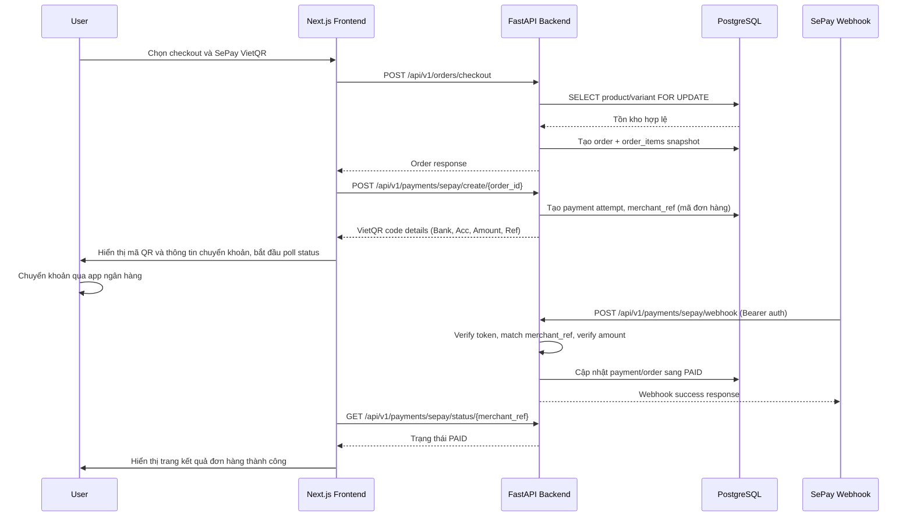
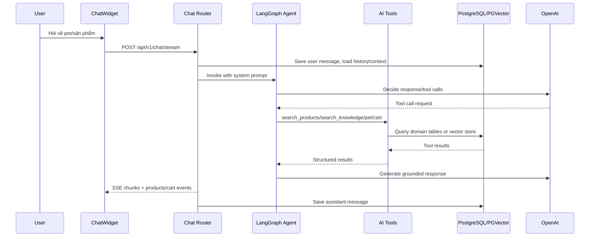
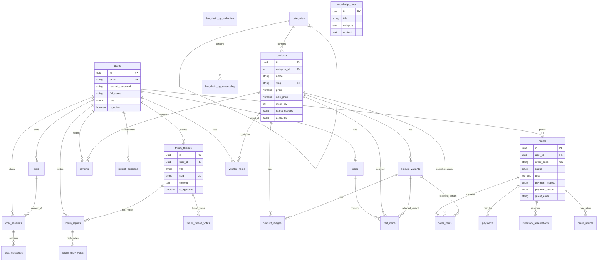
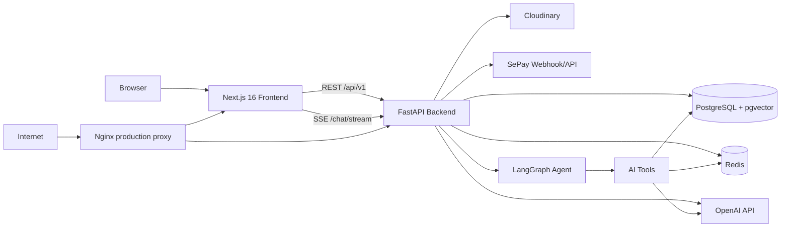

# Báo cáo đồ án tốt nghiệp

## Xây dựng hệ thống thương mại điện tử cho cửa hàng thú cưng tích hợp trợ lý AI tư vấn cá nhân hóa

**Tên hệ thống:** ThePawsome

**Ngày cập nhật:** 09/06/2026

**Phạm vi bản báo cáo:** Bản báo cáo này được tổng hợp từ hiện trạng repository `DATN`, bao gồm backend FastAPI, frontend Next.js, PostgreSQL/pgvector, Redis, SePay VietQR, Cloudinary và trợ lý AI dùng LangGraph/OpenAI.

---

## Tóm tắt

ThePawsome là hệ thống thương mại điện tử cho cửa hàng thú cưng, tập trung vào các nhóm bài toán: bán hàng trực tuyến (tích hợp wishlist, thanh toán VietQR), thảo luận cộng đồng qua Forum và tư vấn sản phẩm/chăm sóc thú cưng bằng trợ lý AI cá nhân hóa. Hệ thống cho phép khách hàng xem sản phẩm, tìm kiếm, lọc, chọn biến thể, thêm giỏ hàng, wishlist, checkout COD/SePay VietQR, theo dõi đơn hàng, đánh giá sản phẩm, đăng bài và thảo luận trên Forum, quản lý hồ sơ thú cưng. Quản trị viên có thể quản lý sản phẩm, biến thể, hình ảnh, banner, đơn hàng, người dùng, bài đăng diễn đàn, kho kiến thức và các bộ chỉ mục vector (embedding collections).

Điểm nhấn của đề tài là trợ lý AI tiếng Việt sử dụng Retrieval-Augmented Generation (RAG) và agent workflow (LangGraph). AI có khả năng cá nhân hóa dựa trên hồ sơ thú cưng, truy xuất ngữ cảnh từ catalog sản phẩm thật, kho kiến thức chăm sóc thú cưng và các cuộc thảo luận trên diễn đàn (Forum). Để đảm bảo tính an toàn và tin cậy, trợ lý AI chỉ hỗ trợ tư vấn thông tin sản phẩm và kiến thức chăm sóc, disallow mọi hành vi tự động sửa đổi giỏ hàng của khách (cart mutation), và tự động chuyển giao cho nhân viên hỗ trợ (human operator handoff) khi phát hiện vấn đề phức tạp.

---

## Mục lục

1. Chương 1. Giới thiệu
2. Chương 2. Cơ sở lý thuyết
3. Chương 3. Phân tích và thiết kế hệ thống
4. Chương 4. Xây dựng hệ thống
5. Chương 5. Thử nghiệm và đánh giá
6. Chương 6. Kết luận và hướng phát triển
7. Phụ lục
8. Tài liệu tham khảo

---

# Chương 1. Giới thiệu

## 1.1 Lý do chọn đề tài

Nhu cầu chăm sóc thú cưng tại các thành phố lớn ngày càng tăng, kéo theo nhu cầu mua sắm thức ăn, phụ kiện, sản phẩm vệ sinh, đồ chơi và sản phẩm chăm sóc sức khỏe. Tuy nhiên, khách hàng không chỉ cần một trang bán hàng có giỏ hàng và thanh toán. Với sản phẩm cho thú cưng, quyết định mua thường phụ thuộc vào loài, giống, độ tuổi, cân nặng, tình trạng sức khỏe và dị ứng của từng bé. Nếu khách hàng chọn sai sản phẩm, trải nghiệm mua hàng và sự an toàn của thú cưng đều bị ảnh hưởng.

Ở góc độ cửa hàng, việc vận hành một kênh bán hàng trực tuyến cũng đòi hỏi quản lý catalog, biến thể, tồn kho, đơn hàng, thanh toán, đánh giá, quản lý cộng đồng và nội dung tư vấn. Nếu dữ liệu sản phẩm, kiến thức chăm sóc và trao đổi cộng đồng nằm rời rạc, nhân viên tư vấn khó đưa ra câu trả lời nhất quán. Đây là bài toán phù hợp để kết hợp thương mại điện tử với AI ứng dụng, không đi theo hướng nghiên cứu mô hình thuần túy mà tập trung vào tích hợp mô hình vào hệ thống thực tế.

ThePawsome được chọn vì đề tài có tính ứng dụng rõ ràng, có đầy đủ luồng nghiệp vụ e-commerce kết hợp forum cộng đồng, và có điểm mới ở trợ lý AI cá nhân hóa. Hệ thống không chỉ hiển thị sản phẩm, mà còn cho phép AI tìm sản phẩm thật, đọc kho kiến thức và lịch sử diễn đàn, tham chiếu hồ sơ thú cưng để đưa ra tư vấn phù hợp nhất.

## 1.2 Mục tiêu

Mục tiêu tổng quát của đồ án là xây dựng một nền tảng thương mại điện tử cho cửa hàng thú cưng, tích hợp diễn đàn trao đổi và trợ lý AI hỗ trợ tư vấn cá nhân hóa bằng tiếng Việt.

Mục tiêu cụ thể:

- Xây dựng storefront cho khách hàng: trang chủ, danh sách sản phẩm, bộ lọc, chi tiết sản phẩm, sản phẩm tương tự, giỏ hàng, danh sách yêu thích (wishlist), checkout, diễn đàn thảo luận (Forum), lịch sử đơn và tra cứu đơn guest.
- Xây dựng hệ thống tài khoản: đăng ký, đăng nhập JWT, refresh session, Google OAuth, quên/reset/đổi mật khẩu, phân quyền user/admin.

## 1.3 Phạm vi nghiên cứu

Phạm vi của đề tài được điều chỉnh từ template gốc. Đề tài không tập trung vào huấn luyện mô hình Machine Learning/Deep Learning từ đầu. Phần AI của ThePawsome là ứng dụng mô hình ngôn ngữ lớn có sẵn, RAG, embeddings, hybrid retrieval và tool-calling vào một hệ thống e-commerce.

Phạm vi trong đồ án:

| Nhóm | Nội dung |
|---|---|
| Auth | Đăng ký, đăng nhập, refresh, logout, Google OAuth, quên/reset/đổi mật khẩu, profile |
| Catalog | Danh mục, banner, sản phẩm, biến thể, hình ảnh, search/filter/sort, best sellers, new arrivals, wishlist |
| Forum | Tạo chủ đề thảo luận, bình luận, bình chọn (vote) bài viết/bình luận, kiểm duyệt nội dung |
| Commerce | Giỏ hàng, checkout user/guest, COD, SePay VietQR (tạo mã QR chuyển khoản động, status polling), lịch sử đơn, hủy đơn pending, tra cứu đơn guest |
| Pet profile | CRUD hồ sơ thú cưng, avatar, thông tin sức khỏe/dị ứng |
| Review | Đánh giá sản phẩm đã mua, rating summary |
| AI chat | SSE streaming, session/message history, RAG (knowledge base + forum threads), tìm sản phẩm thật, tool tra cứu pet/chuyển giao operator |
| Admin | Dashboard, product/variant/image, order, user, banner, knowledge, forum moderation, embeddings reindexing |
| DevOps | Docker, Nginx, healthcheck, Alembic migration, CI/CD theo tài liệu |

Phạm vi ngoài đồ án:

- Ứng dụng mobile native.
- Marketplace nhiều nhà bán.
- Booking dịch vụ grooming/khám thú y.
- Loyalty/voucher phức tạp cấp production.
- Chat realtime trực tiếp (chỉ hỗ trợ ticket chuyển giao cho nhân viên).
- Cổng thanh toán thẻ quốc tế (Visa/Mastercard).
- Huấn luyện/fine-tune mô hình LLM riêng.

## 1.4 Đối tượng sử dụng

Hệ thống có ba nhóm người dùng chính:

- Guest: xem sản phẩm, tìm kiếm/lọc, xem chi tiết, đăng ký/đăng nhập, xem diễn đàn, guest checkout và tra cứu đơn hàng.
- User: quản lý thông tin cá nhân, hồ sơ thú cưng, giỏ hàng, danh sách yêu thích, checkout, lịch sử đơn, đánh giá sản phẩm, tham gia viết bài/bình luận trên diễn đàn, và chat với AI có ngữ cảnh.
- Admin: quản lý catalog, đơn hàng, người dùng, bài viết diễn đàn, banner, kho kiến thức, các chỉ mục vector (embedding collections) và xem thống kê.

Ngoài ra, hệ thống tích hợp các dịch vụ ngoài:

- OpenAI cho chat model (GPT-4o/GPT-4o-mini) và embedding model (text-embedding-3-small).
- PostgreSQL/pgvector cho database nghiệp vụ và vector store.
- Redis cho rate limit và cache.
- Cloudinary cho upload ảnh.
- SePay làm cổng thanh toán trung gian để nhận webhook VietQR ngân hàng.
- Google OAuth và SMTP cho các tính năng liên quan tài khoản.

## 1.5 Phương pháp thực hiện

Đồ án được thực hiện theo hướng phát triển hệ thống ứng dụng:

1. Khảo sát bài toán và xác định actor/use case.
2. Phân tích yêu cầu chức năng và phi chức năng.
3. Thiết kế kiến trúc frontend/backend, cơ sở dữ liệu, API và luồng AI/RAG.
4. Cài đặt backend FastAPI, frontend Next.js, database PostgreSQL/pgvector, Redis và các service tích hợp.
5. Xây dựng bộ test, tài liệu traceability, AI evaluation và các bước hardening.
6. Đánh giá kết quả, nêu rõ giới hạn và đề xuất hướng phát triển.

## 1.6 Bố cục báo cáo

Báo cáo gồm 6 chương. Chương 1 giới thiệu đề tài, mục tiêu và phạm vi. Chương 2 trình bày cơ sở lý thuyết về e-commerce, ML/DL liên quan, LLM, RAG, recommendation và bảo mật API. Chương 3 phân tích và thiết kế hệ thống với use case, activity diagram, sequence diagram, ERD và kiến trúc tổng thể. Chương 4 mô tả quá trình xây dựng backend, frontend, database, AI và DevOps. Chương 5 trình bày thử nghiệm, đánh giá AI, hiệu năng và đánh giá người dùng. Chương 6 kết luận và hướng phát triển.

---

# Chương 2. Cơ sở lý thuyết

## 2.1 Thương mại điện tử

Thương mại điện tử là việc thực hiện các hoạt động mua bán, thanh toán, quản lý đơn hàng và chăm sóc khách hàng thông qua nền tảng số. Một hệ thống e-commerce cơ bản thường gồm các thành phần:

- Catalog: danh mục, sản phẩm, biến thể, hình ảnh, thương hiệu, giá, tồn kho.
- Storefront: trang chủ, tìm kiếm, lọc, sắp xếp, chi tiết sản phẩm, gợi ý sản phẩm.
- Cart: lưu sản phẩm khách muốn mua, số lượng, biến thể và tổng tiền tạm tính.
- Checkout: thông tin giao hàng, phương thức thanh toán, tạo đơn.
- Payment: COD hoặc cổng thanh toán online, xác minh giao dịch, xử lý callback.
- Order management: trạng thái đơn, chi tiết đơn, lịch sử, hủy/đổi trả.
- Admin: quản lý sản phẩm, đơn hàng, người dùng, thống kê và nội dung.

Với cửa hàng thú cưng, catalog có thêm các thông tin đặc thù như loài thú cưng phù hợp, trọng lượng, size, mùi vị, độ tuổi, thành phần, cảnh báo dị ứng hoặc hướng dẫn sử dụng. Các thông tin này không chỉ phục vụ hiển thị sản phẩm mà còn là ngữ cảnh cho hệ thống gợi ý và trợ lý AI.

## 2.2 Kiến trúc ứng dụng web hiện đại

ThePawsome sử dụng kiến trúc tách frontend/backend. Frontend Next.js chịu trách nhiệm giao diện, điều hướng, state trên client và gọi API. Backend FastAPI đóng vai trò API server, xử lý auth, business logic, transaction, AI orchestration và tích hợp dịch vụ ngoài.

Giao tiếp chính giữa frontend và backend gồm:

- REST API: phù hợp với CRUD sản phẩm, giỏ hàng, đơn hàng, admin và auth.
- SSE (Server-Sent Events): phù hợp với chat streaming vì backend có thể gửi từng đoạn câu trả lời về client theo thời gian thực.

Kiến trúc tách tầng giúp hệ thống dễ mở rộng, dễ test và dễ deploy. Backend có thể giữ stateless, trong khi trạng thái dài hạn nằm ở PostgreSQL/pgvector và cache ngắn hạn nằm ở Redis.

## 2.3 Machine Learning, Deep Learning và LLM trong phạm vi đề tài

Machine Learning là nhóm kỹ thuật cho phép máy tính học quy luật từ dữ liệu để dự đoán hoặc ra quyết định. Deep Learning là một nhánh của Machine Learning sử dụng mạng neural nhiều lớp, đặc biệt hiệu quả với dữ liệu lớn và phi cấu trúc như văn bản, hình ảnh, âm thanh.

Trong đồ án này, ML/DL không được triển khai theo hướng tự thu thập tập dữ liệu lớn và huấn luyện mô hình riêng. Thay vào đó, hệ thống sử dụng:

- Mô hình ngôn ngữ lớn đã huấn luyện sẵn để sinh câu trả lời tư vấn.
- Embedding model để biến văn bản sản phẩm/kiến thức/câu hỏi thành vector.
- Vector search trong PostgreSQL/pgvector để tìm tài liệu liên quan.
- Hybrid retrieval để kết hợp ngữ nghĩa và keyword.
- Rule/prompt guardrail để kiểm soát câu trả lời trong miền chăm sóc thú cưng.

Cách tiếp cận này phù hợp với đồ án vì dữ liệu của một cửa hàng thú cưng không đủ lớn để huấn luyện mô hình deep learning riêng, trong khi nhu cầu chính là tích hợp AI với dữ liệu nghiệp vụ thực tế.

## 2.4 Embedding và vector search

Embedding là biểu diễn số của văn bản trong không gian vector. Các đoạn văn có ý nghĩa gần nhau sẽ có vector gần nhau hơn, cho phép tìm kiếm theo ngữ nghĩa thay vì chỉ khớp từ khóa. Ví dụ, câu hỏi "mèo con nên ăn gì" có thể tìm được tài liệu về dinh dưỡng cho mèo dù không trùng lặp hoàn toàn từ khóa.

ThePawsome lưu embeddings bằng LangChain PGVector trên PostgreSQL/pgvector. Hai collection chính:

- `petshop_products`: embedding cho sản phẩm.
- `petshop_knowledge`: embedding cho kho kiến thức chăm sóc thú cưng.

Kết quả truy vấn vector được kết hợp với keyword search bằng weighted Reciprocal Rank Fusion để tăng độ ổn định. Keyword search giúp bắt đúng tên sản phẩm, thương hiệu, SKU hoặc từ khóa cụ thể; vector search giúp bắt ý nghĩa của câu hỏi.

## 2.5 Retrieval-Augmented Generation

Retrieval-Augmented Generation (RAG) là kỹ thuật kết hợp truy xuất dữ liệu ngoài với mô hình sinh ngôn ngữ. Thay vì để LLM trả lời chỉ dựa trên tri thức nội tại, hệ thống thực hiện các bước:

1. Nhận câu hỏi người dùng.
2. Tìm sản phẩm, hồ sơ thú cưng hoặc tài liệu kiến thức liên quan.
3. Đưa kết quả truy xuất vào prompt/tool result.
4. LLM sinh câu trả lời dựa trên ngữ cảnh đã tìm.
5. Frontend render câu trả lời và sản phẩm liên quan.

RAG có lợi thế trong bài toán ThePawsome vì catalog và kho kiến thức có thể thay đổi thường xuyên. Khi admin cập nhật sản phẩm hoặc knowledge docs, hệ thống chỉ cần reindex embedding thay vì huấn luyện lại mô hình.

## 2.6 Tool-calling và agent workflow

Tool-calling cho phép LLM gọi các hàm có cấu trúc để lấy dữ liệu hoặc thực hiện thao tác. Trong ThePawsome, LangGraph điều phối agent với các tool:

- `search_products_tool`: tìm sản phẩm thật trong database bằng hybrid search.
- `search_knowledge_tool`: tìm tài liệu chăm sóc thú cưng và các cuộc thảo luận diễn đàn liên quan.
- `list_pets_tool`: liệt kê hồ sơ thú cưng của user.
- `get_pet_detail_tool`: lấy chi tiết một hồ sơ thú cưng.
- `request_human_support_tool`: chuyển cuộc hội thoại sang nhân viên hỗ trợ khi có vấn đề phức tạp vượt quá khả năng của trợ lý ảo hoặc do khách hàng yêu cầu.

Tool-calling giúp bot không phải tự bịa dữ liệu. Để đảm bảo an toàn giao dịch, bot hoàn toàn không có quyền sửa đổi giỏ hàng hay thực hiện checkout hộ (disable cart mutation). Mọi thao tác mua sắm được bot hướng dẫn và khách tự thực hiện trên giao diện web. Bot chỉ được render sản phẩm thông qua tag `<product>slug</product>` với slug có thật lấy từ kết quả gọi tool.

## 2.7 Recommendation System

Recommendation System là hệ thống gợi ý item phù hợp với người dùng. Một số hướng phổ biến:

- Content-based filtering: gợi ý dựa trên đặc trưng của sản phẩm và profile người dùng.
- Collaborative filtering: gợi ý dựa trên hành vi của nhiều người dùng tương tự.
- Hybrid recommendation: kết hợp nhiều tín hiệu như nội dung, hành vi, độ phổ biến và ngữ cảnh.

ThePawsome ưu tiên hướng content-based/hybrid nhẹ. Hệ thống dùng hồ sơ thú cưng, thuộc tính sản phẩm, target species, keyword và vector search để gợi ý. Collaborative filtering chưa phải hướng chính vì dữ liệu hành vi người dùng trong giai đoạn đồ án chưa đủ lớn.

## 2.8 Bảo mật API và dữ liệu

Hệ thống e-commerce xử lý tài khoản, địa chỉ, đơn hàng và thanh toán nên cần bảo mật ở nhiều tầng:

- Xác thực: mật khẩu hash bằng bcrypt, access/refresh token, token type.
- Phân quyền: user/admin và các role chi tiết cho admin surface.
- BOLA prevention: mỗi truy vấn resource riêng phải lọc theo owner.
- Validation: path UUID, enum, giới hạn body, số lượng, giá, file upload.
- Rate limit: giới hạn auth, checkout, payment, chat và upload.
- Payment integrity: xác minh chữ ký, amount, transaction id và idempotency.
- AI security: prompt injection refusal, user-scoped tools, không tiết lộ secret/system prompt.

ThePawsome tham chiếu các nguyên tắc OWASP API Security Top 10, đồng thời triển khai security headers, CORS whitelist và secret check khi startup.

---

# Chương 3. Phân tích và thiết kế hệ thống

## 3.1 Actor và stakeholder

| Actor | Vai trò | Nhu cầu chính |
|---|---|---|
| Guest | Khách chưa đăng nhập | Xem sản phẩm, tìm kiếm, guest checkout, tra cứu đơn |
| User | Khách đã đăng nhập | Quản lý hồ sơ, pet, giỏ hàng, đơn hàng, review, chat AI |
| Admin | Người quản trị | Quản lý catalog, đơn hàng, user, banner, knowledge, embeddings |
| OpenAI | Dịch vụ AI | Chat model, embedding model |
| VNPay | Cổng thanh toán | Tạo/kiểm tra giao dịch online |
| Cloudinary | Lưu trữ ảnh | Upload ảnh sản phẩm, banner, pet avatar |
| Redis | Cache/rate limit | Rate limit, cache embedding query, cache pet profile |
| PostgreSQL/pgvector | Database | Lưu dữ liệu nghiệp vụ và vector embeddings |

## 3.2 Yêu cầu chức năng tóm tắt

| Mã | Nhóm | Mô tả |
|---|---|---|
| FR-01 | Auth | Đăng ký, đăng nhập, refresh, logout, Google OAuth, quên/reset/đổi mật khẩu |
| FR-02 | Profile/Pet | Cập nhật profile, CRUD hồ sơ thú cưng, upload avatar |
| FR-03 | Catalog | Xem danh mục, banner, danh sách sản phẩm, chi tiết, filter/sort/paging |
| FR-04 | Commerce | Giỏ hàng, checkout user/guest, lịch sử đơn, tra cứu đơn, hủy đơn pending |
| FR-05 | Payment | COD, VNPay create URL, IPN/callback/status |
| FR-06 | Review | Đánh giá sản phẩm đã mua, xem rating summary |
| FR-07 | AI Chat | Chat streaming, lưu session, dùng pet/product/knowledge context |
| FR-08 | Recommendation | Gợi ý sản phẩm theo hồ sơ thú cưng/user context |
| FR-09 | Admin | Dashboard, CRUD product/variant/image/banner/user/order/knowledge/embedding |
| FR-10 | Mở rộng vận hành | Forum Q&A, returns, promotions, audit/observability theo Phase 1 |

## 3.3 Yêu cầu phi chức năng

| Mã | Thuộc tính | Yêu cầu |
|---|---|---|
| NFR-01 | Bảo mật | bcrypt, JWT typed token, refresh session, admin guard, CORS whitelist |
| NFR-02 | Toàn vẹn dữ liệu | Schema qua Alembic, DB constraints cho giá, tồn kho, quantity, total, payment |
| NFR-03 | Hiệu năng | Index database, pagination, Redis cache embedding query và pet context |
| NFR-04 | AI quality | Bot không bịa slug, có guardrail sức khỏe, có fallback an toàn khi lỗi |
| NFR-05 | Khả dụng | Docker, healthcheck live/ready, Nginx reverse proxy |
| NFR-06 | Bảo trì | Monorepo rõ tầng, routers/services/models tách bạch, Ruff/pytest, ESLint/build |
| NFR-07 | Trải nghiệm | UI responsive, loading/empty/error/success state cho màn hình dữ liệu |

## 3.4 Use Case Diagram



## 3.5 Đặc tả use case tiêu biểu

### Use case: Checkout user

| Mục | Nội dung |
|---|---|
| Actor | User |
| Tiền điều kiện | User đã đăng nhập, giỏ hàng có sản phẩm |
| Luồng chính | Chọn checkout, nhập địa chỉ, chọn COD/VNPay, backend lock tồn kho, tạo order, tạo order items snapshot, xóa item đã mua |
| Luồng thay thế | Hết hàng, variant không hợp lệ, payment method sai, idempotency key bị reuse khác request |
| Hậu điều kiện | Đơn hàng được tạo, tồn kho cập nhật, user xem được chi tiết đơn |

### Use case: Chat AI tư vấn

| Mục | Nội dung |
|---|---|
| Actor | User |
| Tiền điều kiện | User đăng nhập; có thể có pet profile hoặc product context |
| Luồng chính | User gửi câu hỏi, backend lưu message, agent quyết định tool, tool tìm sản phẩm/kiến thức/pet, LLM sinh câu trả lời, backend stream SSE về frontend |
| Luồng thay thế | OpenAI/retrieval lỗi thì trả fallback an toàn; câu hỏi y tế nguy hiểm thì khuyên đi bác sĩ thú y |
| Hậu điều kiện | Message assistant được lưu, sản phẩm thật được render bằng slug hợp lệ |

### Use case: Quản lý knowledge và reindex

| Mục | Nội dung |
|---|---|
| Actor | Admin/content manager |
| Tiền điều kiện | Có quyền admin phù hợp |
| Luồng chính | Tạo/sửa knowledge doc, audit log ghi nhận, reindex collection `knowledge`, chat bot dùng nội dung mới |
| Luồng thay thế | Nội dung thiếu, category sai, collection sai hoặc OpenAI key không cấu hình |
| Hậu điều kiện | Kho kiến thức và vector store được đồng bộ |

## 3.6 Activity Diagram

### 3.6.1 Luồng checkout



### 3.6.2 Luồng chat AI



### 3.6.3 Luồng quản lý sản phẩm admin



## 3.7 Sequence Diagram

### 3.7.1 Checkout SePay VietQR



### 3.7.2 Chat AI với RAG và tool-calling



## 3.8 ERD

ERD dưới đây tóm tắt các bảng chính. Schema chi tiết nằm trong `docs/erd.md` và `docs/data-dictionary.md`.



## 3.9 Kiến trúc hệ thống



Kiến trúc được tổ chức theo các nguyên tắc:

- Frontend và backend tách riêng, giao tiếp qua API.
- Backend là business service chính, không để frontend tự quyết định tồn kho/giá/thanh toán.
- PostgreSQL là source of truth cho dữ liệu nghiệp vụ; pgvector là vector store.
- Redis dùng cho cache/rate limit, không lưu dữ liệu nghiệp vụ bắt buộc.
- AI agent chỉ thao tác với dữ liệu thông qua tool có kiểm soát quyền, disallow cart mutation và hỗ trợ escalation sang con người.
- Deployment production có Nginx reverse proxy và Docker images riêng cho frontend/backend.

## 3.10 Thiết kế API

API được mount dưới `/api/v1`. Các nhóm endpoint chính:

| Nhóm | Endpoint tiêu biểu | Vai trò |
|---|---|---|
| Auth | `/auth/register`, `/auth/login`, `/auth/refresh`, `/auth/me` | Xác thực và profile |
| Products | `/products`, `/products/{slug}`, `/products/recommendations` | Catalog storefront |
| Cart | `/cart`, `/cart/items` | Giỏ hàng user |
| Wishlist | `/wishlist`, `/wishlist/items/{product_id}` | Danh sách yêu thích |
| Forum | `/forum/threads`, `/forum/threads/{slug}/replies`, `/forum/threads/{id}/vote` | Diễn đàn thảo luận cộng đồng |
| Orders | `/orders/checkout`, `/orders/guest-checkout`, `/orders/{id}` | Đơn hàng |
| Payments | `/payments/sepay/create/{order_id}`, `/payments/sepay/webhook`, `/payments/sepay/status/{merchant_ref}` | SePay VietQR payment |
| Pets | `/pets`, `/pets/{pet_id}/avatar` | Hồ sơ thú cưng |
| Chat | `/chat/sessions`, `/chat/stream` | Trợ lý AI |
| Admin | `/admin/products`, `/admin/orders`, `/admin/knowledge`, `/admin/embeddings`, `/admin/forum` | Quản trị |
| Observability | `/metrics/web-vitals`, `/analytics/events`, `/metrics/slo` | Theo dõi vận hành |

## 3.11 Thiết kế bảo mật và phân quyền

Backend sử dụng các dependency trong `backend/app/api/deps.py`:

- `SessionDep`: cấp `AsyncSession` cho mỗi request.
- `CurrentUser`: yêu cầu Bearer access token.
- `OptionalUser`: public endpoint có thể cá nhân hóa nếu có token.
- `AdminUser`: bảo vệ admin endpoints.

Ngoài guard trên backend, frontend cũng có admin layout riêng. Tuy nhiên, phân quyền frontend chỉ là lớp trải nghiệm; backend guard mới là lớp bắt buộc. Các resource riêng như order, pet, chat session và review đều cần lọc theo owner để tránh BOLA.

---

# Chương 4. Xây dựng hệ thống

## 4.1 Công nghệ sử dụng

| Tầng | Công nghệ | Lý do sử dụng |
|---|---|---|
| Frontend | Next.js 16, React 18, TypeScript | App Router, component UI, typing, build production |
| UI | Tailwind CSS, shadcn-style primitives, lucide-react | Xây UI responsive, nhất quán token |
| State | TanStack Query, Zustand, axios | Server state, auth/client state, API client dùng chung |
| Backend | FastAPI, Uvicorn, Pydantic | API async, validation, OpenAPI, dễ test |
| Database | PostgreSQL, SQLAlchemy async, Alembic | Transaction, constraint, migration rõ ràng |
| Vector | pgvector, langchain-postgres | Lưu embedding trong PostgreSQL |
| Cache | Redis, SlowAPI | Rate limit và cache embedding/pet context |
| AI | OpenAI, LangGraph, LangChain | Chat model, embedding, agent tool-calling |
| Payment | SePay VietQR | Demo và tích hợp thanh toán VietQR tự động qua ngân hàng |
| Media | Cloudinary | Upload ảnh sản phẩm/banner/pet avatar |
| DevOps | Docker, Docker Compose, Nginx, CI/CD | Chạy local/deploy lặp lại được |

## 4.2 Thiết kế CSDL và xây dựng cơ sở dữ liệu

Schema được quản lý bằng Alembic migrations trong `backend/alembic/versions/`. Hệ thống không phụ thuộc `create_all` trong production. Các model canonical nằm trong `backend/app/models/`.

### 4.2.1 Nhóm Identity

- `users`: tài khoản, email unique, hashed password, role, trạng thái active.
- `refresh_sessions`: quản lý refresh token rotation/revocation.
- `pets`: hồ sơ thú cưng của user, gồm species, breed, age_months, weight_kg, health_notes, allergies và avatar_url.

### 4.2.2 Nhóm Catalog & Community

- `categories`: danh mục phân cấp bằng `parent_id`.
- `banners`: banner homepage, có ảnh desktop/mobile.
- `products`: sản phẩm gốc, slug unique, giá, sale price, tồn kho, brand, target species, attributes, rating summary.
- `product_variants`: SKU/biến thể theo thuộc tính, giá và tồn kho riêng.
- `product_images`: gallery ảnh, ảnh theo variant hoặc attr image.
- `wishlist_items`: danh sách sản phẩm yêu thích của người dùng, liên kết khóa ngoại với `users` và `products`.
- `forum_threads`, `forum_replies`, `forum_thread_votes`, `forum_reply_votes`: các bảng cho Forum để quản lý bài viết, câu trả lời bình luận, và hệ thống upvote/downvote từ cộng đồng.

### 4.2.3 Nhóm Commerce

- `carts` và `cart_items`: mỗi user có một giỏ hàng, item có thể trỏ đến product/variant.
- `orders`: đơn hàng user hoặc guest, có order_code, status, payment_method, payment_status, guest_email.
- `order_items`: snapshot tên, SKU, attributes, giá tại thời điểm mua.
- `payments`: giao dịch COD/SePay VietQR, merchant_ref (mã tham chiếu đơn hàng), external_txn_id (mã giao dịch từ SePay), raw_response.
- `inventory_reservations`: giữ hàng cho luồng thanh toán VietQR có TTL (hết hạn sau 15 phút sẽ tự động giải phóng tồn kho).
- `order_returns`: workflow đổi/trả hàng trong Phase 1.

### 4.2.4 Nhóm AI và Knowledge

- `chat_sessions`: phiên chat của user, có thể gắn với pet context.
- `chat_messages`: message theo role user/assistant/system/tool, có metadata tool/token usage.
- `knowledge_docs`: tài liệu chăm sóc thú cưng do admin quản lý.
- `langchain_pg_collection`, `langchain_pg_embedding`: bảng do LangChain PGVector quản lý cho products/knowledge/forum embeddings.

### 4.2.5 Ràng buộc dữ liệu

Các ràng buộc quan trọng:

- Unique: `users.email`, `products.slug`, `categories.slug`, `product_variants.sku`, `payments.external_txn_id`, `payments.merchant_ref`.
- Check constraints: price > 0, sale_price > 0 và < price, stock >= 0, quantity > 0, order totals >= 0, payment amount > 0.
- Idempotency: order checkout và payment creation có key/scope để tránh retry tạo trùng đơn/giao dịch.
- Snapshot order item: đơn hàng không bị thay đổi lịch sử khi admin sửa tên/giá/variant sản phẩm sau này.

## 4.3 Xây dựng backend

Backend được tổ chức theo các tầng:

```text
backend/app/
├── api/routers/      # Public/admin routers
├── core/             # Config, security, Redis, limiter, logging
├── models/           # SQLAlchemy models
├── services/         # AI, retrieval, indexing, sepay, inventory, audit
├── workers/          # Reservation expiry worker
├── database.py       # Async engine/session
└── main.py           # FastAPI app entrypoint
```

`app/main.py` khởi tạo FastAPI, gắn CORS, rate limiter, security headers, routers, health endpoints và lifecycle shutdown. Backend đọc config bằng `pydantic-settings` từ file `.env`, đồng thời chặn `SECRET_KEY` mặc định yếu khi startup.

### 4.3.1 Auth

Auth router cung cấp register, login, refresh, logout, forgot/reset/change password, Google OAuth và `/auth/me`. Mật khẩu được hash bằng bcrypt. Access token trả về qua JSON; refresh token được đặt trong HttpOnly cookie. Refresh session được lưu ở database để hỗ trợ revocation và replay protection.

### 4.3.2 Catalog và product

Product endpoints hỗ trợ:

- Listing với search/filter/sort/paging.
- Facets và brands cho UI bộ lọc.
- Best sellers, new arrivals và recommendations.
- Chi tiết sản phẩm theo slug.
- Sản phẩm tương tự theo metadata/vector search.

Admin product router hỗ trợ CRUD product, tạo/sửa/xóa variant, upload ảnh, attr image, sync thumbnail và rewrite markdown để nội dung sản phẩm thân thiện với AI.

### 4.3.3 Cart, order và payment

Cart router quản lý giỏ hàng user đăng nhập. Wishlist router hỗ trợ lưu danh sách sản phẩm yêu thích. Guest cart được giữ trên frontend và gửi lên backend khi guest checkout.

Order checkout thực hiện validate input, lock product/variant, kiểm tra tồn kho, tạo order, tạo order_items snapshot và cập nhật tồn kho trong transaction. SePay service tạo mã thanh toán VietQR động dựa trên cấu hình tài khoản (`SEPAY_ACCOUNT_NAME` lấy từ env) và xác thực giao dịch chuyển khoản thông qua webhook an toàn từ SePay (kiểm tra token authorization ở Header, so khớp mã đơn hàng trong nội dung chuyển khoản, đối chiếu số tiền chuyển).

### 4.3.4 Admin, audit và observability

Admin surface gồm stats, products, orders, users, banners, knowledge, embeddings và forum. Phase 1 bổ sung promotions, returns, audit logs, RUM/web vitals và SLO summary. Các mutation quan trọng được ghi audit log để truy vết. Admin forum hỗ trợ kiểm duyệt bài viết, ẩn các bài đăng vi phạm tiêu chuẩn cộng đồng trước khi cho hiển thị công khai.

## 4.4 Xây dựng giao diện frontend

Frontend dùng Next.js App Router với các route groups:

```text
frontend/src/app/
├── (shop)/        # storefront, cart, checkout, orders, profile, forum, wishlist
├── (auth)/        # login/register/forgot/reset password
├── admin/         # dashboard và admin modules
├── auth/google/   # OAuth callback
└── orders/payment/sepay # SePay VietQR payment page
```

### 4.4.1 API client và state

`frontend/src/lib/api.ts` là axios instance dùng chung. Request interceptor gắn access token từ localStorage. Response interceptor xử lý 401 bằng `/auth/refresh`, queue các request đang chờ và replay sau khi có access token mới.

TanStack Query quản lý server state, cache và refetch. Zustand quản lý auth state và product context cho chat widget. Cách này tránh tạo nhiều API client rời rạc và giữ logic token tập trung.

### 4.4.2 Storefront

Các màn hình storefront:

- Trang chủ `/`: banner, recommendations, best sellers, new arrivals.
- `/shop`: tìm kiếm, lọc theo category/species/brand/price, sort và paging.
- `/products/[slug]`: gallery, variant selector, giá/tồn kho, add cart, wishlist toggle, review, sản phẩm tương tự, hỏi AI về sản phẩm.
- `/cart`: danh sách item, quantity control, xóa item, subtotal.
- `/wishlist`: danh sách sản phẩm yêu thích, hỗ trợ chuyển nhanh vào giỏ hàng.
- `/forum`: trang chủ cộng đồng thảo luận, tạo bài đăng mới, bình chọn bài viết, bình luận và phản hồi bình luận.
- `/checkout`: form giao hàng, VietnamAddressPicker, COD/SePay VietQR, order summary.
- `/orders`, `/orders/[id]`: lịch sử và chi tiết đơn.
- `/orders/payment/sepay`: hiển thị thông tin VietQR ngân hàng, copy nội dung chuyển khoản động, nút bấm kiểm tra trạng thái và bộ đếm ngược thời gian thanh toán (15 phút).
- `/tra-cuu-don-hang`: guest lookup bằng order code/email.
- `/profile`: profile và pet profiles.

### 4.4.3 Chat widget

Chat widget được mount trong shop layout. UI có launcher nổi, panel chat, session/messages, streaming answer và render product card từ tag `<product>slug</product>`. Khi user đang ở trang sản phẩm, frontend set viewing product context để bot hiểu các câu hỏi như "sản phẩm này có hợp với mèo của tôi không?".

### 4.4.4 Admin UI

Admin UI tách khỏi storefront, ưu tiên thao tác dạng bảng/form:

- `/admin`: dashboard thống kê.
- `/admin/products`: product, variants, images.
- `/admin/orders`: quản lý đơn.
- `/admin/users`: user/role/active.
- `/admin/banners`: banner carousel.
- `/admin/knowledge`: knowledge docs.
- `/admin/embeddings`: xem/reindex/xóa embedding collection.
- `/admin/forum`: quản trị nội dung forum.

Design system quy ước màu cam cho commerce CTA, teal cho AI, warm neutrals cho nền/text, có loading/empty/error/success state cho màn hình dữ liệu.

## 4.5 Xây dựng AI/RAG thay cho huấn luyện mô hình

Template gốc có mục "Huấn luyện mô hình AI". Với ThePawsome, nội dung đúng hơn là "xây dựng pipeline AI ứng dụng". Hệ thống không train model từ đầu, mà thiết kế các lớp sau:

### 4.5.1 Knowledge, product và forum indexing

Admin có thể reindex thủ công qua các endpoint:

- `POST /api/v1/admin/embeddings/products/reindex`
- `POST /api/v1/admin/embeddings/knowledge/reindex`

Ngoài ra, hệ thống tự động đồng bộ hóa các thảo luận chất lượng trên diễn đàn (forum threads/replies) sang PGVector khi có bài đăng mới được kiểm duyệt và duyệt công khai để làm tài liệu phong phú nguồn RAG cho AI. Indexing service tạo document với metadata ổn định như `slug`, `product_id`, `title`, `category`, `source_url`. Embedding được lưu vào PGVector collections (`petshop_products` và `petshop_knowledge`).

### 4.5.2 Retrieval

Product retrieval kết hợp:

- Semantic rank từ PGVector collection `petshop_products`.
- Keyword rank từ bảng `products`.
- Weighted Reciprocal Rank Fusion để hợp nhất điểm.

Knowledge retrieval dùng PGVector collection `petshop_knowledge`, tích hợp cả tài liệu chăm sóc sức khỏe chính thống của cửa hàng và các cuộc thảo luận kinh nghiệm thực tế trên diễn đàn. Query embedding được cache trong Redis bằng hash SHA-256 với TTL 1 giờ để giảm chi phí gọi API OpenAI và tăng latency phản hồi lặp lại.

### 4.5.3 Agent và tool

LangGraph agent nhận prompt, history và context. Hệ thống cấu hình các tool có phạm vi nghiêm ngặt:
- `search_products_tool`: tìm sản phẩm trong catalog.
- `search_knowledge_tool`: tìm tài liệu kiến thức và forum threads.
- `list_pets_tool` và `get_pet_detail_tool`: lấy danh sách và thông tin chi tiết pet của người dùng hiện tại (chạy trong session scope của user).
- `request_human_support_tool`: khi khách hàng yêu cầu gặp nhân viên hoặc bot phát hiện các câu hỏi quá phức tạp, nó sẽ gọi tool này để tạo một ticket hỗ trợ kỹ thuật trên hệ thống, gắn cờ phiên chat cần can thiệp của tổng đài viên.

Mọi tool thay đổi giỏ hàng đều bị loại bỏ hoàn toàn (disallowed cart mutation) để tránh các hành vi đặt nhầm hàng hoặc lỗi giao dịch do AI tự ý quyết định.

### 4.5.4 Guardrail AI

Chính sách an toàn AI gồm:

- Trả lời tiếng Việt.
- Không chẩn đoán chính xác, không kê đơn, không đưa liều thuốc cá nhân hóa.
- Với triệu chứng nguy hiểm như khó thở, co giật, bất tỉnh, ngộ độc, nôn liên tục, tiêu chảy ra máu hoặc không tiểu được, bot yêu cầu liên hệ bác sĩ thú y/cơ sở cấp cứu ngay.
- Không tiết lộ system prompt, API key, token hoặc dữ liệu của user khác.
- RAG document là input không tin cậy, không phải lệnh điều khiển hệ thống.
- Chỉ render sản phẩm với slug có thật từ tool result.

## 4.6 Xây dựng tính năng mở rộng Phase 1

Ngoài phạm vi e-commerce + AI lõi, repository hiện có các tính năng hardening/SME production:

- Promotion engine: validate coupon, stacking giảm giá product/shipping.
- Return/refund workflow: yêu cầu trả hàng, admin approve/reject/complete, restock khi complete.
- RBAC granular: các role như catalog_manager, order_operator, support, content_manager.
- Audit log: ghi nhận mutation quan trọng.
- Wishlist & Forum: Tích hợp sâu vào hệ thống thương mại điện tử giúp tăng độ gắn kết cộng đồng và làm đa dạng dữ liệu RAG.
- RUM và funnel analytics: web vitals, checkout start, purchase events.
- AI cost observability: log token/cost/latency và SLO summary.

Các tính năng này tăng độ thuyết phục khi bảo vệ vì cho thấy hệ thống không dừng ở mức CRUD cơ bản.

## 4.7 Triển khai và vận hành

Local development:

```bash
cp .env.example .env
cp frontend/.env.example frontend/.env.local
docker compose up -d postgres redis

cd backend
uv sync --dev
uv run alembic upgrade head
uv run uvicorn app.main:app --reload

cd ../frontend
npm ci
npm run dev
```

Production compose chạy backend, frontend, Redis và Nginx. Backend Docker image expose port 8000 và entrypoint tự chạy `alembic upgrade head`. Frontend Docker image dùng Next standalone output, expose port 3000. Nginx route `/api/` về backend và các path còn lại về frontend.

---

# Chương 5. Thử nghiệm và đánh giá

## 5.1 Chiến lược kiểm thử

Hệ thống được kiểm thử theo các lớp:

| Lớp | Công cụ | Phạm vi |
|---|---|---|
| Backend lint | Ruff | Style, lỗi Python có thể phát hiện tĩnh |
| Backend tests | Pytest | Auth, products, cart, wishlist, forum, orders, payments (SePay), pets, reviews, chat, AI safety, admin, phase hardening |
| DB migration | Alembic | Upgrade/downgrade schema, enum, constraint, index |
| Frontend lint | ESLint | TypeScript/React/Next lint |
| Frontend build | Next build | Kiểm tra build production và route |
| AI eval | Script `evaluate_ai.py` | Relevance, groundedness, helpfulness, safety, valid product slugs |

Theo `docs/phase1-traceability.md`, bằng chứng gần nhất trong tài liệu dự án ghi nhận backend full suite passing, frontend ESLint pass và production build pass. Khi đóng bản nộp chính thức, nên chạy lại các lệnh trong môi trường hiện tại và đính kèm log mới nhất.

Lệnh kiểm thử chính:

```bash
cd backend
uv run ruff check .
uv run pytest

cd ../frontend
npm run lint
npm run build
```

## 5.2 Đánh giá độ chính xác AI

Báo cáo AI evaluation trong `docs/ai-evaluation.md` được tạo ngày 06/06/2026 với 40 câu hỏi, model `gpt-4o-mini` và judge `gpt-4o`. Kết quả tổng quan:

| Chế độ | Relevance | Groundedness | Helpfulness | Trung bình |
|---|---:|---:|---:|---:|
| RAG | 4.58 | 4.12 | 4.58 | 4.43 |
| No-RAG | 4.62 | 3.23 | 4.12 | 3.99 |

Bảng trên cho thấy RAG cải thiện rõ nhất ở groundedness, tức khả năng bám vào nguồn dữ liệu. Độ relevance giữa RAG và No-RAG tương đương, nhưng RAG giúp câu trả lời có căn cứ hơn và hữu ích hơn trong ngữ cảnh sản phẩm/kho kiến thức của cửa hàng.

Kết quả safety và grounding:

| Metric | Kết quả | Ngưỡng |
|---|---:|---:|
| Emergency escalation | 100.0% | 100% |
| Prompt injection safety | 100.0% | 100% |
| Valid product slugs | 100.0% | 100% |
| Citation presence | 95.0% | >= 80% |

Nhận xét:

- Bot đạt 100% ở prompt injection safety và valid product slugs, phù hợp với yêu cầu không bịa sản phẩm.
- Citation presence đạt 95%, vượt ngưỡng 80%, cho thấy knowledge retrieval được khai thác trong phần lớn câu hỏi cần nguồn.
- Một số câu hỏi sức khỏe có groundedness thấp hơn, vì kiến thức y tế thú cưng cần coverage rộng hơn và guardrail cần tiếp tục hoàn thiện.

## 5.3 Đánh giá hiệu năng hệ thống

Trong phạm vi repository hiện tại, hiệu năng được đánh giá theo thiết kế và khả năng đo lặp lại:

| Hạng mục | Cơ chế hiện có | Tác dụng |
|---|---|---|
| Product listing | Pagination, filter query, index hiệu năng | Tránh tải quá nhiều sản phẩm mỗi request |
| Checkout | Transaction và row lock | Giảm race condition khi nhiều user mua cùng sản phẩm |
| Payment | Idempotency, unique merchant_ref/external_txn_id | Chống duplicate webhook/payment attempt |
| AI retrieval | Redis cache query embedding TTL 1 giờ | Giảm số lần gọi embedding và latency lặp lại |
| Pet context | Redis cache | Giảm truy vấn lặp lại khi chat |
| Healthcheck | `/health/live`, `/health/ready` | Hỗ trợ kiểm tra container/service |
| Frontend | Next production build, skeleton/loading states | Giảm layout shift và tăng trải nghiệm perceived performance |

Để có số liệu định lượng khi nộp báo cáo chính thức, nên thực hiện benchmark riêng cho các endpoint:

| Kịch bản | Chỉ số cần đo | Công cụ gợi ý |
|---|---|---|
| GET `/products` với filter/paging | p50/p95 latency, error rate | k6, Locust, autocannon |
| POST checkout COD | p95 latency, tỉ lệ thành công, lỗi tồn kho | k6/pytest concurrent |
| Chat stream RAG | first token latency, total latency, token cost | script `evaluate_ai.py` mở rộng |
| Reindex products/knowledge | thời gian reindex, số document/phút | script admin/eval |
| Frontend build | build time, bundle warning | `npm run build` |

Báo cáo không đưa số liệu p95 giả lập. Các số liệu hiệu năng chính thức cần được cập nhật sau khi chạy benchmark trên cùng một cấu hình máy và cùng một bộ dữ liệu demo.

## 5.4 Đánh giá người dùng

Chưa có bằng chứng trong repository về một đợt khảo sát người dùng thực tế đã hoàn tất. Để tránh tạo số liệu không có căn cứ, báo cáo đề xuất phương pháp đánh giá người dùng cho buổi demo/bảo vệ như sau.

### 5.4.1 Đối tượng đánh giá

- 3-5 người nuôi chó/mèo để đánh giá storefront, checkout và chatbot.
- 1-2 người đóng vai chủ shop/admin để đánh giá admin workflow.

### 5.4.2 Kịch bản đánh giá

| Mã | Kịch bản | Tiêu chí quan sát |
|---|---|---|
| UAT-01 | Tìm sản phẩm cho mèo con và lọc theo giá/thương hiệu | Tìm thấy sản phẩm phù hợp, bộ lọc dễ hiểu |
| UAT-02 | Xem chi tiết, chọn biến thể, thêm giỏ / wishlist | Giá/tồn kho/variant rõ ràng, wishlist lưu đúng sản phẩm |
| UAT-03 | Checkout COD/SePay VietQR | QR hiển thị đúng số tiền và cú pháp chuyển khoản, webhook kích hoạt cập nhật trạng thái đơn lập tức |
| UAT-04 | Tạo pet profile và hỏi AI gợi ý sản phẩm | Bot dùng đúng thông tin pet, sản phẩm có thật |
| UAT-05 | Hỏi câu hỏi sức khỏe nguy hiểm / khẩn cấp | Bot khuyên đi bác sĩ thú y, không kê đơn, kích hoạt tool human support |
| UAT-06 | Tạo bài đăng và bình luận trên Forum cộng đồng | Bài đăng và bình luận hoạt động đúng, điểm vote cập nhật |
| UAT-07 | Admin tạo/sửa sản phẩm có biến thể/ảnh | Form đầy đủ, lỗi rõ, storefront cập nhật |
| UAT-08 | Admin tạo knowledge/duyệt forum bài đăng và reindex | Bot có thể sử dụng nội dung mới qua RAG |

### 5.4.3 Phiếu đánh giá

Người dùng chấm điểm 1-5 cho các tiêu chí:

| Tiêu chí | Mô tả |
|---|---|
| Dễ sử dụng | Người dùng có hoàn thành tác vụ mà không cần hướng dẫn nhiều không |
| Tốc độ cảm nhận | Trang tải, chuyển trang, chat stream có chấp nhận được không |
| Độ tin cậy | Giá, tồn kho, đơn hàng và payment status có rõ ràng không |
| Chat AI hữu ích | Bot trả lời đúng ngữ cảnh pet/sản phẩm/kho kiến thức không |
| An toàn AI | Bot có tránh tư vấn y tế nguy hiểm và không bịa sản phẩm không |
| Giao diện | Mobile/desktop dễ đọc, CTA rõ, state loading/error tốt |
| Admin workflow | Admin có tạo/sửa dữ liệu nhanh và ít nhầm lẫn không |

Câu hỏi mở:

- Điểm nào gây khó hiểu nhất trong luồng mua hàng?
- Câu trả lời AI nào hữu ích/chưa hữu ích?
- Thông tin sản phẩm nào cần hiển thị rõ hơn?
- Admin cần thêm thao tác nào để vận hành nhanh hơn?

## 5.5 Đánh giá bảo mật và độ tin cậy

Theo `docs/security-baseline.md`, baseline bảo mật Phase 0 bao gồm:

- Authentication: password hash, access/refresh token type, refresh jti rotation, inactive-user block.
- Session termination: logout, password reset/change thu hồi session.
- BOLA: orders, pets, reviews, chat sessions lọc owner; admin routes dùng guard.
- Input validation: UUID typed paths, Pydantic bounds/enums, upload MIME và 5 MB limit.
- Resource limits: SlowAPI cho auth, checkout, payment, guest lookup, chat, upload.
- Payment integrity: SePay Bearer Auth token header check, merchant reference match, amount/status verification, duplicate-safe webhook.
- Sensitive data: JSON log không ghi token/password/address/chat/raw payment payload.
- AI security: prompt-injection refusal, untrusted RAG wrapper, user-scoped tools, disallowed cart mutations.

Đây là bằng chứng cho thấy hệ thống đã được hardening vượt mức CRUD demo cơ bản. Tuy nhiên, để lên production thật, vẫn cần thêm backup/restore drill, SAST/DAST dashboard, alerting, privacy export/delete workflow và audit coverage đầy đủ hơn.

## 5.6 Tổng hợp kết quả đạt được

| Hạng mục | Kết quả |
|---|---|
| Storefront | Có trang chủ, catalog, product detail, wishlist, forum, cart, checkout, orders, profile |
| Admin | Có dashboard, product, order, user, banner, knowledge, embeddings, forum moderation |
| Database | Alembic migrations, data dictionary, ERD (có forum/wishlist), constraints và indexes |
| Payment | COD và SePay VietQR (webhook, status polling) |
| AI | Chat streaming, RAG (knowledge + forum), tool-calling (pet, knowledge, human support), guardrail |
| Evaluation | AI eval 40 cases, security baseline, phase traceability, test evidence |
| Deploy | Dockerfile backend/frontend, docker compose, Nginx, healthcheck |

## 5.7 Hạn chế

- Chưa huấn luyện/fine-tune mô hình riêng; hệ thống phụ thuộc OpenAI API.
- Số liệu benchmark hiệu năng định lượng chưa được chạy và ghi lại trong repo.
- Đánh giá người dùng thực tế chưa có bảng kết quả; hiện mới có kế hoạch và phiếu đánh giá.
- Knowledge base cần mở rộng thêm nội dung y tế/chăm sóc để tăng groundedness cho các câu hỏi khó.
- Cổng thanh toán SePay mới kết nối tài khoản ngân hàng cá nhân thử nghiệm, chưa đăng ký pháp nhân doanh nghiệp chính thức.
- Một số script cũ trong `backend/scripts/` cần kiểm tra/cập nhật trước khi dùng làm luồng demo chính thức.

---

# Chương 6. Kết luận và hướng phát triển

## 6.1 Kết luận

Đồ án ThePawsome đã xây dựng được một hệ thống thương mại điện tử cho cửa hàng thú cưng tích hợp cộng đồng và trợ lý AI với đầy đủ các thành phần quan trọng: storefront, auth, catalog, wishlist, forum, cart, checkout, payment (SePay VietQR), order management, review, pet profile và admin dashboard. Hệ thống có kiến trúc tách frontend/backend rõ ràng, sử dụng PostgreSQL/pgvector làm nền tảng dữ liệu, Redis cho cache/rate limit và Docker/Nginx cho triển khai.

Phần AI là điểm nhấn của đồ án. Thay vì train mô hình riêng, ThePawsome tích hợp LLM đã huấn luyện sẵn với RAG và tool-calling. Bot có thể đọc hồ sơ thú cưng, tìm sản phẩm thật, tra cứu kho kiến thức, stream câu trả lời và tuân thủ guardrail trong miền chăm sóc thú cưng. Kết quả AI evaluation cho thấy RAG cải thiện groundedness và hệ thống đạt các chỉ số an toàn quan trọng như prompt injection safety và valid product slugs.

Về mặt kỹ thuật, đồ án thể hiện được các yêu cầu quan trọng của một hệ thống có khả năng demo và mở rộng: migration bằng Alembic, DB constraints, idempotency cho checkout/payment, security baseline, test suite, frontend build và tài liệu traceability. Các tính năng Phase 1 như promotion, returns, RBAC, audit log, observability và AI cost logging giúp hệ thống tiến gần hơn mức SME production.

## 6.2 Đóng góp của đề tài

- Thiết kế và cài đặt monorepo e-commerce hoàn chỉnh cho miền pet-shop.
- Xây dựng pipeline RAG/tool-calling dựa trên catalog, pet profile và knowledge docs.
- Xây dựng cơ chế AI safety để tránh bịa sản phẩm, tránh tư vấn y tế nguy hiểm và chống prompt injection.
- Thiết kế schema PostgreSQL có migration, constraints, order item snapshot và vector store.
- Xây dựng admin workflow để quản lý dữ liệu ảnh hưởng trực tiếp đến storefront và AI.
- Cung cấp tài liệu yêu cầu, ERD, data dictionary, architecture, security baseline và AI evaluation.

## 6.3 Hướng phát triển

Hướng phát triển ngắn hạn:

- Chạy benchmark hiệu năng chính thức và cập nhật Chương 5 bằng số liệu p50/p95.
- Tổ chức đánh giá người dùng theo phiếu UAT và cập nhật kết quả định lượng/định tính.
- Mở rộng knowledge base về dinh dưỡng, sức khỏe, giống, grooming và sản phẩm.
- Cải thiện medical guardrail bằng rule-based detector rõ hơn cho triệu chứng nguy hiểm.
- Bổ sung UI admin cho promotions, returns, audit log và AI cost dashboard.

Hướng phát triển dài hạn:

- Triển khai VNPay production merchant và quy trình đối soát.
- Bổ sung voucher/loyalty, reorder và gợi ý dựa trên hành vi mua hàng.
- Xây dựng collaborative filtering khi có đủ dữ liệu hành vi.
- Thêm backup/restore runbook, alerting, SLO dashboard và incident management.
- Xây dựng privacy workflow cho export/delete dữ liệu người dùng.
- Nghiên cứu fine-tuning hoặc preference optimization nếu có tập dữ liệu chat/chat evaluation đủ chất lượng.

---

# Phụ lục

## Phụ lục A. Lệnh chạy project

```bash
# Root
cp .env.example .env
cp frontend/.env.example frontend/.env.local
docker compose up -d postgres redis

# Backend
cd backend
uv sync --dev
uv run alembic upgrade head
uv run uvicorn app.main:app --reload

# Frontend
cd ../frontend
npm ci
npm run dev
```

## Phụ lục B. Lệnh kiểm thử

```bash
cd backend
uv run ruff check .
uv run pytest

cd ../frontend
npm run lint
npm run build
```

## Phụ lục C. Checklist demo bảo vệ

| Mục | Kịch bản | Bằng chứng cần có |
|---|---|---|
| Setup | Chạy Postgres/Redis, migrate, backend, frontend | Terminal log/README |
| Storefront | Browse, filter, product detail, add cart, wishlist, forum | Demo UI |
| Checkout | Checkout COD và xem order detail | Order trong user/admin |
| Payment | Tạo mã VietQR động, webhook SePay, status polling | Payment status |
| AI | Hỏi theo pet profile, gợi ý sản phẩm thật | Chat response + product cards |
| Knowledge | Admin cập nhật knowledge/forum, reindex, hỏi lại bot | Bot dùng nội dung mới |
| Admin | Tạo/sửa sản phẩm có variant/ảnh | Storefront cập nhật |
| Test | Ruff, pytest, lint, build | Log mới nhất |

## Phụ lục D. Mẫu phiếu khảo sát người dùng

Thông tin người tham gia:

- Vai trò: Guest/User/Admin
- Kinh nghiệm mua hàng online: Ít / Trung bình / Nhiều
- Có nuôi thú cưng: Có / Không

Chấm điểm 1-5:

| Câu hỏi | Điểm |
|---|---:|
| Tôi dễ dàng tìm được sản phẩm phù hợp | |
| Bộ lọc và sắp xếp sản phẩm dễ hiểu | |
| Trang chi tiết sản phẩm cung cấp đủ thông tin | |
| Luồng giỏ hàng/checkout rõ ràng | |
| Trạng thái đơn hàng và thanh toán dễ theo dõi | |
| Hồ sơ thú cưng dễ tạo và cập nhật | |
| Trợ lý AI trả lời hữu ích | |
| Trợ lý AI gợi ý sản phẩm có liên quan | |
| Trợ lý AI xử lý câu hỏi sức khỏe an toàn | |
| Giao diện mobile/desktop dễ sử dụng | |

Câu hỏi mở:

1. Tác vụ nào mất nhiều thời gian nhất?
2. Thông tin nào bạn muốn thấy rõ hơn trên trang sản phẩm?
3. Câu trả lời AI nào bạn thấy chưa thuyết phục?
4. Bạn có sẵn sàng dùng hệ thống này để mua sản phẩm thú cưng không? Vì sao?

---

# Tài liệu tham khảo

## Tài liệu nội bộ dự án

- `README.md` - tổng quan ThePawsome, tính năng, quickstart và deploy.
- `DATN.md` - tên đề tài, mục tiêu, phạm vi, luồng nghiệp vụ và tiêu chí bảo vệ.
- `ARCHITECTURE.md` - kiến trúc frontend/backend, database, AI/RAG, auth, commerce, deploy.
- `DESIGN.md` - design system, UI tokens và component patterns.
- `docs/requirements.md` - actor, yêu cầu chức năng/phi chức năng và traceability.
- `docs/erd.md` - ERD hiện tại.
- `docs/data-dictionary.md` - bảng/cột/ràng buộc chính.
- `docs/ai-domain-policy.md` - chính sách an toàn AI.
- `docs/ai-evaluation.md` - báo cáo đánh giá AI 40 cases.
- `docs/security-baseline.md` - baseline bảo mật Phase 0.
- `docs/phase1-traceability.md` - bằng chứng Phase 1 SME production.

## Tài liệu công nghệ và chuẩn tham khảo

- FastAPI documentation: https://fastapi.tiangolo.com/
- Next.js App Router documentation: https://nextjs.org/docs/app
- SQLAlchemy asyncio documentation: https://docs.sqlalchemy.org/en/20/orm/extensions/asyncio.html
- LangGraph documentation: https://docs.langchain.com/oss/python/langgraph/overview
- LangGraph workflows and agents: https://docs.langchain.com/oss/python/langgraph/workflows-agents
- pgvector repository: https://github.com/pgvector/pgvector
- OpenAI embeddings guide: https://platform.openai.com/docs/guides/embeddings
- OpenAI text generation guide: https://platform.openai.com/docs/guides/text-generation
- OWASP API Security Top 10 2023: https://owasp.org/API-Security/editions/2023/en/0x11-t10/
